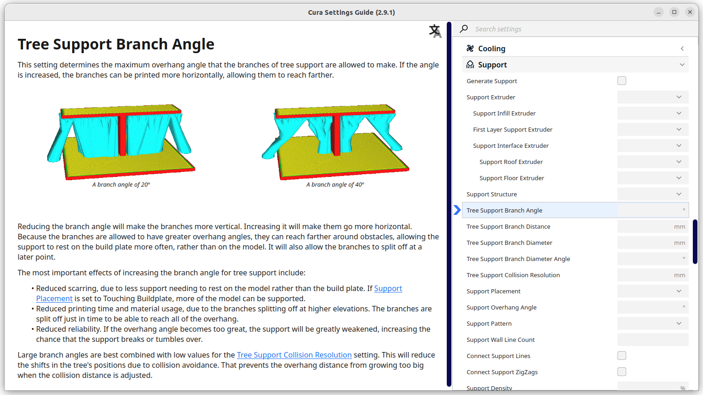

Settings Guide
====
This Cura plug-in provides additional explanations with pictures and animations for many Cura settings.

Installation
----
You can install this plug-in in several ways.
1. **Marketplace:** In Cura, go to the Marketplace and find the Settings Guide in the list. Click it, then click on "install" and restart Cura.
2. **From package:** Go to the [releases](https://github.com/Ghostkeeper/SettingsGuide/releases) page and download the latest release. Select the SDK version that fits your version of Cura:

    |Cura version|SDK|
    |------------|---|
    |4.0         |6.0|
    |4.1         |6.0|
    |4.2         |6.0|
    |4.3         |6.0|
    |4.4         |7.0|
    |4.5         |7.0|
    |4.6         |7.0|
    |4.7         |7.0|
    |4.8         |7.0|

    Drag that package file onto the Cura window, then restart Cura.
3. **Building packages:** Download the latest source code [from Github](https://github.com/Ghostkeeper/SettingsGuide/archive/master.zip), then in a terminal run `cmake . && make pack` to create a .curapackage file for each supported SDK version. Similar to the previous option, select the SDK version that fits your version of Cura and drag it onto the Cura window, then restart Cura.
4. **From source:** Download the latest source code [from Github](https://github.com/Ghostkeeper/SettingsGuide/archive/master.zip). In Cura, click on "Help", "Show configuration folder". Navigate to the "plugins" subfolder and unpack the .zip file from Github there. Rename the folder to "SettingsGuide2" (removing any suffix that Github added such as "-master"). Rename the `plugin.json.in` file to simply `plugin.json` and fill in the CMake variables inside. Restart Cura.

Usage
----
To use this plug-in, right click on a setting you'd like to know more about. Then click "Settings Guide".

Alternatively, click on "Extensions" in the application menu, then click on "Settings Guide".
