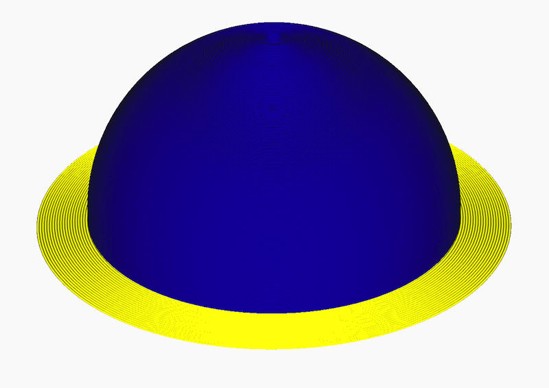
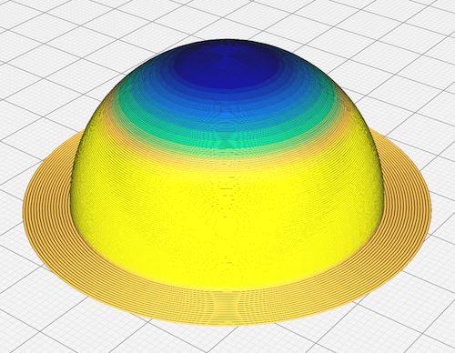

Adaptive layers calculates the optimal layer height based on the 3D model's surface features.
The layer height will be reduced when there is a slope on that part of the model, and increased when the wall is completely vertical.

