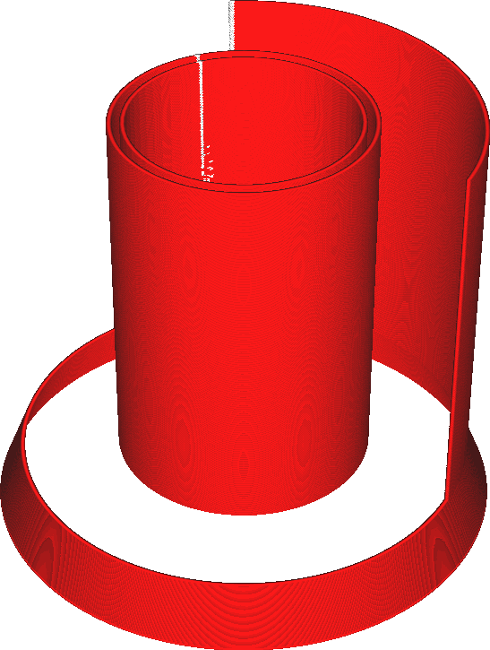

Surface Mode
====
Normally, Cura will create cross sections of all the triangles in your mesh. These line segments are stitched together to form loops. Any loops that are not closed will be discarded.

This setting controls what will be done with these unclosed loops. If set to "Normal", they are discarded. If set to "Surface", all of the cross sections are printed as outlines. If set to "Both", the closed outlines are printed normally but the unclosed ones are printed separately as extra walls.

<!--screenshot {
"image_path": "magic_mesh_surface_mode_normal.png",
"model_path": "extra_surface.py",
"camera_position": [66, 129, 124],
"camera_lookat": [0, 0, 17.5],
"layer": 9999,
"line": 0,
"settings": {
    "magic_mesh_surface_mode": "normal"
},
"colours": 32
}-->
<!--screenshot {
"image_path": "magic_mesh_surface_mode_surface.png",
"model_path": "extra_surface.py",
"camera_position": [66, 129, 124],
"camera_lookat": [0, 0, 17.5],
"settings": {
    "magic_mesh_surface_mode": "surface"
},
"colours": 32
}-->
<!--screenshot {
"image_path": "magic_mesh_surface_mode_both.png",
"model_path": "extra_surface.py",
"camera_position": [66, 129, 124],
"camera_lookat": [0, 0, 17.5],
"settings": {
    "magic_mesh_surface_mode": "both"
},
"colours": 32
}-->

The extra surfaces that get printed will only include the vertical surfaces as single lines. There is no filling technique for horizontal surfaces, since the surfaces are not closed polygons. They cannot be filled since there is no inside. There can be no tops, bottoms, infill or supports. Only single lines.

The extra surfaces will be printed as if they are outer walls, so they will be affected by the outer wall printing speed, line width, and so on. It will also print these surfaces using a line that is precisely centred on the surface, rather than aligning the line along the inside of the model. That means that it extends with half a line width on either side of the surface. This happens because it is ambiguous which side of the surface is the inside of the model. Your print will not be dimensionally accurate. If, like in the screenshot above, the extra surface is aligned with a normal, solid surface, and you're using the "Both" option to complete any missing walls then the layers will not properly align.

**If printing both the normal volumes and the extra surfaces, keep in mind that the volumes will be printed with the outer wall completely inside the volume. The extra surfaces are printed with the line centred on the surface, with half of the line's width on either side. If an extra surface is aligned to the surface of a closed volume, as in the pictures above, the surface will be shifted by half a line width. After all, the extra surface has no inside to move towards.**