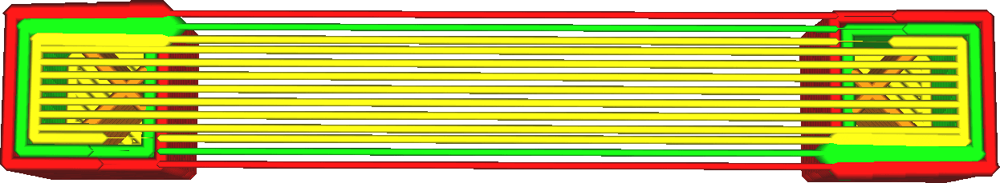

When bridging with wall lines, just before a bridge is printed, the material feed is paused for a moment. During this time, the remaining material inside the nozzle chamber is allowed to flow out, to reduce the pressure inside the nozzle chamber. This technique is called [coasting](coasting_enable.md). With this setting, the amount of coasting can be controlled. Essentially this controls how far ahead of a bridge the material will stop flowing.

After the bridge is complete, the material that was not extruded will be expunged anyway. The total amount of material extrusion will remain the same. This restores the pressure on the nozzle, which prevents underextrusion.

The unit of this setting is not meant to be intuitive. The distance ahead of the bridge at which the material will stop flowing depends on a number of factors:
* The length of the wall so far, up until the bridge. The longer the wall, the more it can coast.
* The rate of flow out the nozzle during the normal wall, which depends on the [speed](speed_wall.md), [line width](wall_line_width.md), [flow rate](wall_material_flow.md) and [layer height](layer_height.md) of those walls. The greater the flow rate in normal walls, the longer the coasting distance.
* The rate of flow out the nozzle during the bridged wall, which depends on the [speed](bridge_wall_speed.md) and [flow rate](bridge_wall_flow.md) of those walls. The greater the flow rate in bridged walls, the *shorter* the coasting distance.

This setting is a multiplying factor over the final length.

The purpose of this coasting is to bring the pressure inside the nozzle chamber down. This is necessary, because any remaining pressure in the nozzle chamber will cause the material to be squirted down a considerable distance before solidifying as soon as the counterpressure disappears. This squirting down of material results in sagging. Essentially, the overhanging lines are pushed down by the rest of the material still inside the nozzle. If the pressure inside the nozzle chamber is lessened, this force will be reduced as well and there will be less sagging.

Increasing the amount of coasting will reduce the pressure inside the nozzle chamber by the time the bridge needs to be printed, which will reduce the amount of sagging. The print will be more accurate. However, increasing the amount of coasting too much will result in a period of underextrusion just before the bridge is being printed. Since this underextrusion is in the walls of the print, it will be very visible on the side of the print.