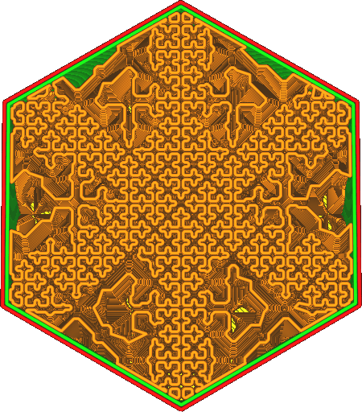
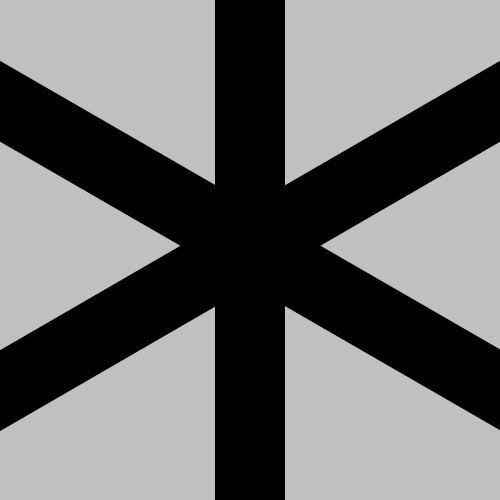

In this setting, you can provide an image that specifies the density in various places across the infill. The infill density will vary in certain places depending on the brightness of the image. This only works for the [Cross Infill (3D) pattern](infill_pattern.md), since that pattern is able to adjust its density without chopping up lines, which would result in interrupted flow and reduced strength.

The path to the image is provided as a local path, for instance `C:\Projects\3D Printing\infill_density.png` on Windows or `/home/ghostkeeper/3d_printing/infill_density.png` on Unix. Supported file formats are JPG, PNG, TGA, BMP, PSD, GIF, HDR and PIC. Image is scaled over the object such that it fits the bounding box of the object exactly. The brightness in the image determines the infill density:
* Where the image is black, the [infill density](infill_sparse_density.md) is used.
* Where the image is white, the infill density will approach 0%.

The infill density will never exceed the value specified by the [infill line distance](infill_line_distance.md). It can only be reduced. The pattern is also limited in where it can reduce its density. While it tries to approximate the desired infill density as closely as possible, this is not always possible. If the infill density is really low, there will be particularly few opportunities to adjust the infill density, causing the print to follow the image very loosely. In places where the infill density is high, the image will be followed very closely. The density of the pattern can only be followed fairly coarsely as well, but Cura will [dither](https://en.wikipedia.org/wiki/Dither) the pattern in order to achieve a greater effective accuracy.

With this setting, the user can customise their infill very far. Since the Cross Infill patterns have most of their use with flexible materials, this setting is used to achieve very specific softness or hardness constraints. For instance, one could print a shoe sole with customised softness to fit the feet better, or a machanical device that has to bend in specific parts. 

**This setting will not transfer well through Cura project files. The project file will store the path to the image as the setting value, but will not store the image. If the project file is opened on a different computer, the density image will likely not be restored.**