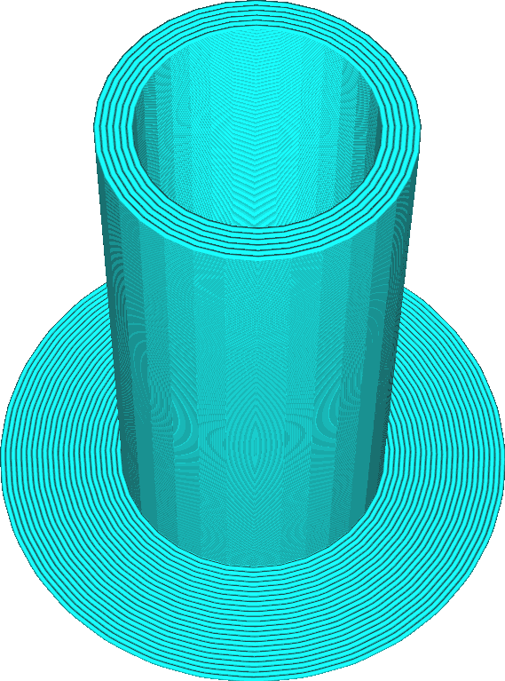

Circular Prime Tower
====
If this setting is enabled, the prime tower will get the shape of a cylinder. If it's disabled, the prime tower will be square.

<!--screenshot {
"image_path": "prime_tower_circular_enabled.png",
"models": [
    {
        "script": "cube.scad",
        "object_settings": {
            "extruder_nr": 0
        }
    },
    {
        "script": "cube.scad",
        "object_settings": {
            "extruder_nr": 1
        },
        "transformation": ["translateX(40)"]
    }
],
"camera_position": [470, -384, 150],
"camera_lookat": [470, -470, 5],
"settings": {
    "prime_tower_enable": true,
    "prime_tower_min_volume": 3
},
"colours": 16
}-->

In either case, the prime tower is still hollow. The circular prime tower is strictly smaller than the square prime tower (as the corners are cut off). The [minimum volume](prime_tower_min_volume.md) will still be correct.

If the material has a tendency to warp, the square prime tower has four corners that can get loose from the build plate. This makes it more likely to topple over, compared to the circular prime tower. There are also greater accelerations involved in printing a square prime tower. These accelerations make the flow rate inconsistent, which is not what you'd want to prime the material.

The circular prime tower is better in almost every aspect. This is why the setting is removed in newer versions of Cura. Those versions will always have a circular prime tower.