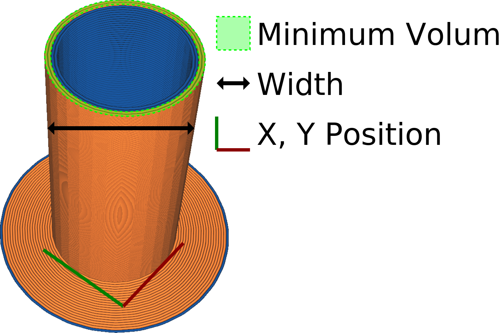

This setting adjusts the width of the prime tower.

Making the prime tower wider will cause it to be more stable. This increases the reliability of your print.

However, a wider prime tower will also take up more space on your build plate. Also, it will increase the amount of material that actually gets purged on top of the [minimum primed volume](prime_tower_min_volume.md), because the purged volume will be rounded up to make complete contours around the tower.