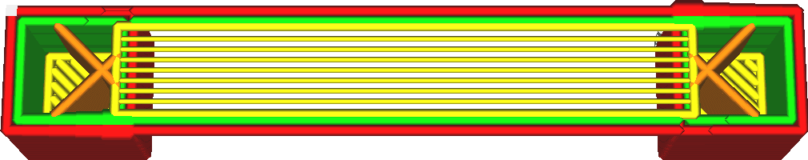

Bridge Skin Flow
====
This setting adjusts the amount of material that is extruded to print bridging bottom sides.

<!--screenshot {
"image_path": "bridge_skin_density_100.png",
"models": [{"script": "bridge.scad"}],
"layer": 80,
"settings": {
    "bridge_settings_enabled": true,
    "bridge_skin_density": 100,
    "bridge_skin_material_flow": 100,
    "bridge_wall_material_flow": 100
},
"camera_position": [0, 18, 79],
"colours": 64
}-->
<!--screenshot {
"image_path": "bridge_skin_material_flow_50.png",
"models": [{"script": "bridge.scad"}],
"layer": 80,
"settings": {
    "bridge_settings_enabled": true,
    "bridge_skin_density": 100,
    "bridge_skin_material_flow": 50,
    "bridge_wall_material_flow": 100
},
"camera_position": [0, 18, 79],
"colours": 64
}-->

Reducing the amount of material will effectively reduce the line width of the bottom side that is bridging a gap. With reduced line width, the lines' surface-to-mass ratio is greater, which allows them to cool down faster and this will prevent them from sagging as much.

However reducing the flow rate too much will cause a great change in the flow rate, especially when combined with a [slower printing speed](bridge_skin_speed.md). In reality the material will not be able to change its flow rates very quickly, which causes the lines to be somewhat thicker than intended as the flow rate is slowed down, and somewhat thinner than intended as the flow rate is sped up.