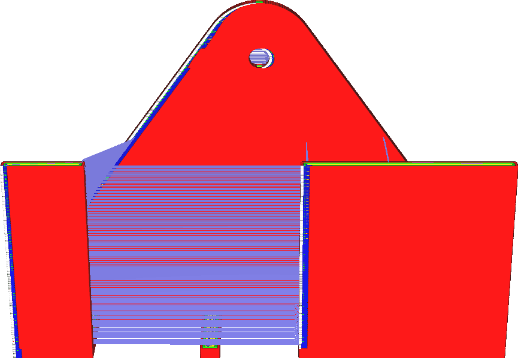

Coasting Volume
====
This setting determines how far before the end of the contour the feeder will stop feeding material. The length of coasting is configured however in a volume of material. It is more closely related to the volume inside the nozzle chamber.

<!--screenshot {
"image_path": "coasting_enable.png",
"models": [{"script": "phone_holder.scad"}],
"camera_position": [0, -215, 117],
"minimum_layer": 1,
"structures": ["travels", "helpers", "shell", "infill", "starts"],
"settings": {
    "coasting_enable": true,
    "coasting_volume": 0.06
},
"colours": 32
}-->
<!--screenshot {
"image_path": "coasting_volume_0_03.png",
"models": [{"script": "phone_holder.scad"}],
"camera_position": [0, -215, 117],
"minimum_layer": 1,
"structures": ["travels", "helpers", "shell", "infill", "starts"],
"settings": {
    "coasting_enable": true,
    "coasting_volume": 0.03
},
"colours": 32
}-->

Increasing the coasting volume causes the nozzle to stop extruding farther before it's finished the contour. The result is that it'll have more underextrusion towards the end. The function of coasting is to compensate for the blob when the contour is seamed, so increasing the coasted volume can compensate for bigger blobs.

However increasing the coasted volume too much will cause harsh underextrusion towards the end of the contour. It can even lead to some underextrusion in whatever is printed after the contour, since the pressure on the nozzle is still low then.