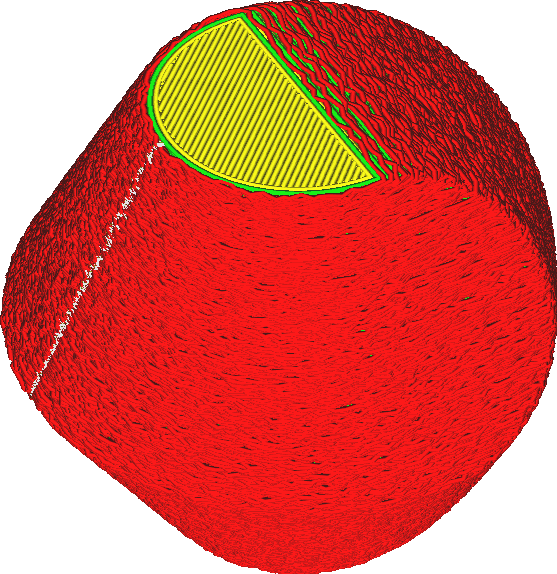

Fuzzy Skin
====
When printing with fuzzy skin, the surface on the sides of the print is made rough on purpose. This gives the print a texture of sorts.

This mode adds a random jitter to the outer wall. The print head will vibrate randomly while printing the outermost wall. This makes the surface feel rough to the touch. The surface is only made fuzzy on the sides of the print. No fuzziness is added to the top.

The fuzziness throws all dimensional accuracy out the window. The print will certainly be larger than the original model. Fuzzy skin will also make the print take longer, since the print head is subject to a lot of acceleration while printing the outer wall.