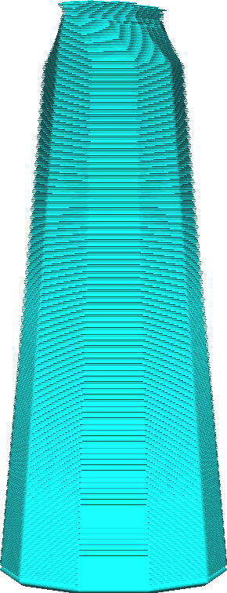

This setting allows you to adjust the width of the tree support's branches. The width specified here will be the width at the top of the tree's branches. The very tip of the branch will be thinner and towards the bottom it gradually becomes wider as per the [Tree Support Branch Diameter Angle](support_tree_branch_diameter_angle.md) setting.

Wider branches are more stable, reducing the chance that the tree gets knocked over by the nozzle if it needs to travel across it.

Wider branches will also merge together faster. This will save some material but can also prevent some of the model from being properly supported, and indeed some of the support itself as well. When branches are merged together they don't have an outline any more. Wide branches are best combined with either a wide [spacing](support_tree_branch_distance.md) or some [infill](support_infill_rate.md) in order to properly support parts in the middle of the wide branches.

Wider branches will also have a harder time navigating around your model. This may cause more of the support to be resting on the model rather than on the build plate. As a result, your model may have more scarring after removal of the support structures.