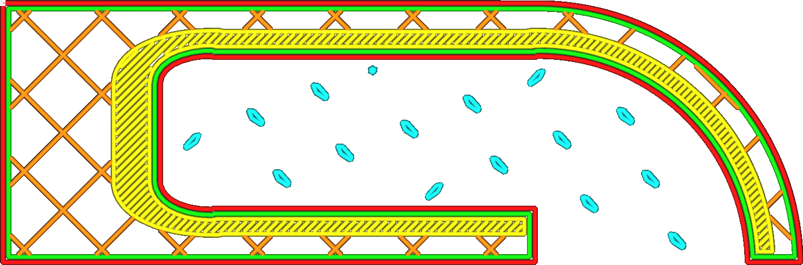

Tree Support Branch Distance
====
This setting determines the distance between two adjacent branches where the branches touch the build plate.

In order to support the model, tree support will place contact points underneath the model in a staggered grid pattern. This setting essentially determines the size of that grid and thereby how far apart the branches are placed. Due to the alignment of the branches with respect to the (default) direction of the skin lines, the distance that the skin lines need to bridge will most likely be greater than this distance.

By reducing the branch distance, a better overhang quality can be achieved because the lines resting on top of the support won't need to bridge as far. The support will also be stiffer because more material will be used towards the top of the support, making the print more reliable.

However reducing the branch distance will also cause the support to take more material and printing time.

Reducing the branch distance below the [Diamètre des branches de support arborescent](./support_tree_branch_diameter.md) will cause the branches to merge before they could properly be formed. As a result the centre of large overhang areas may not get supported properly then.
