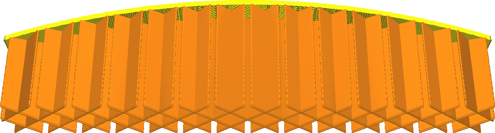
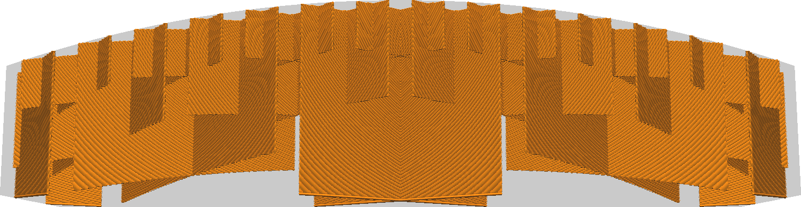

Gradual infill reduces the amount of infill used, by reducing the infill density in the lower layers. This saves on printing time and material, while not reducing surface quality much. The primary purpose of infill when printing for visual quality is to support the top surface. This feature focuses the infill to that purpose only.

This setting indicates in how many steps the infill density gets reduced. At every step, the infill density is halved. For example, starting with an infill percentage of 20% and two gradual infill steps, the infill density of the lower parts will be 10% and 5%, respectively.

**The "Gradual Infill" checkmark in Recommended Mode sets this setting to 5 steps and increases infill density to 90%. This causes a very high density at the top (90%) and a very low density at the bottom of your print (2.8%).**