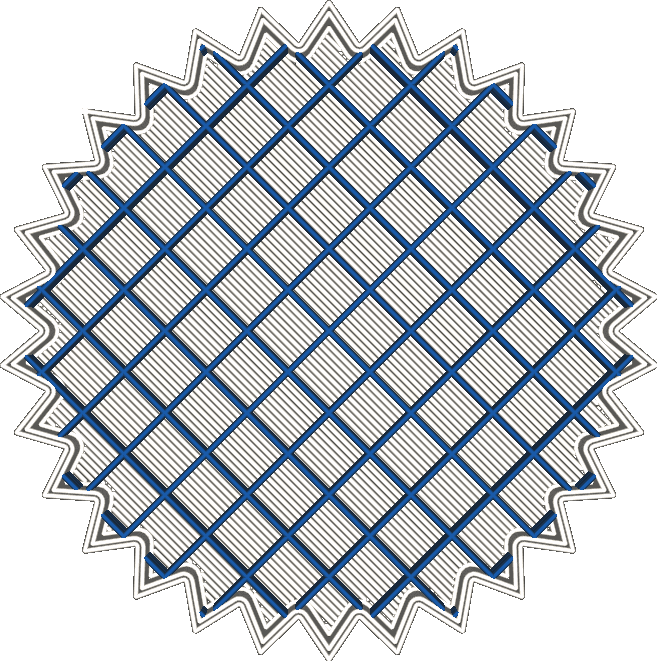

Infill Extruder
====
This setting determines which extruder will be used to print the infill material. It is only available for printers with multiple extruders.

If your printer can use a different nozzle for each extruder train, printing infill with a bigger nozzle size will increase printing speed and strength without impeding visual quality of the shell.