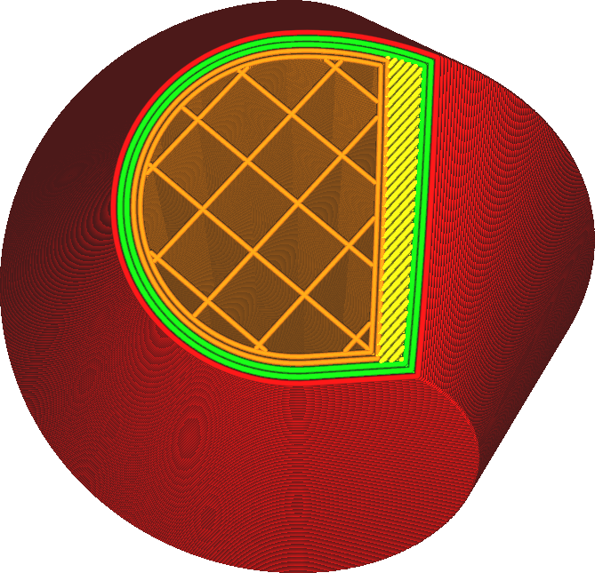

Extra Infill Wall Count
====
This setting adds a number of contours around the infill areas. This is similar to increasing the [number of walls](../shell/wall_line_count.md), but the contours do not go around the skin and the walls will be between the skin and the infill as well. It is also similar to adding [extra skin walls](../shell/skin_outline_count.md), but around the infill instead of around the skin.

These walls are printed with the infill settings.

<!--screenshot {
"image_path": "infill_wall_line_count.png",
"models": [{"script": "hexasphericon.scad"}],
"camera_position": [0, 40, 136],
"settings": {
    "infill_wall_line_count": 2,
    "skin_outline_count": 0
},
"layer": 546,
"colours": 64
}-->

Compared to adding extra walls around the skin, this setting greatly increases strength of the model and reduces the visibility of infill through the skin, but also increases printing time and material usage. Whereas extra skin walls will replace material that would've been printed as skin anyway, this setting actually adds material unless the infill density is already 100%.

This is very similar to adding extra walls around the whole print. However it is a good idea to add at least one extra wall around either the infill or the skin, because it prevents the skin lines from ending in mid-air.