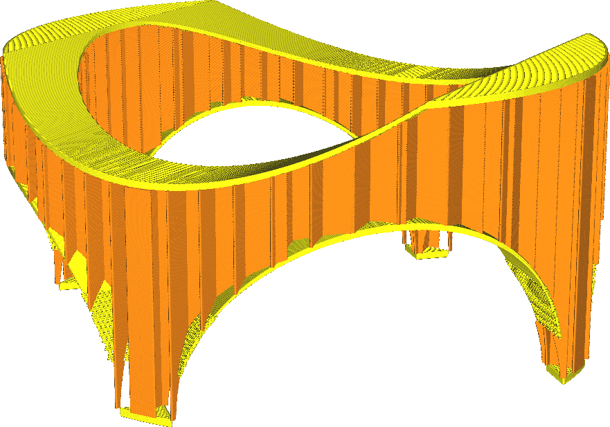
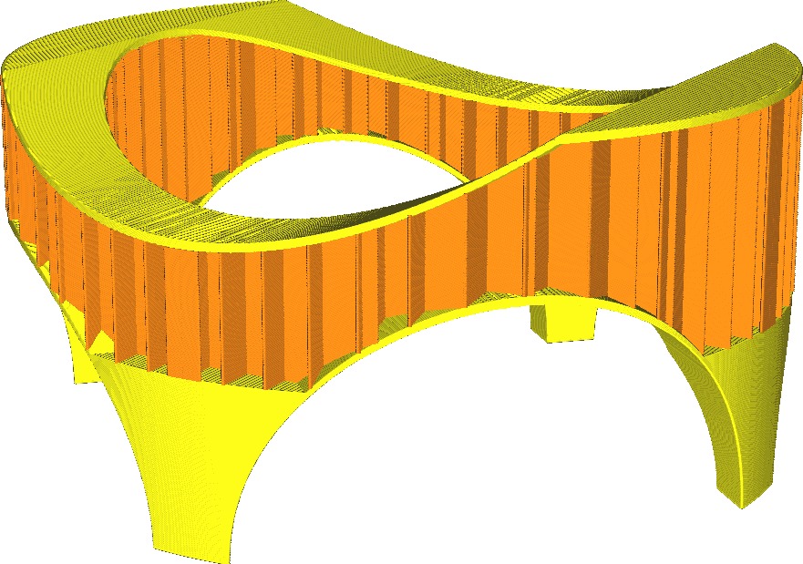

Minimum Infill Area
====
This setting causes very small pieces to be filled with the skin pattern rather than with the infill pattern, making them completely solid.

<!--screenshot {
"image_path": "min_infill_area_disabled.png",
"models": [{"script": "stature.scad"}],
"camera_position": [-64, 224, 82],
"settings": {
    "wall_line_count": 0,
    "min_infill_area": 0
},
"colours": 32
}-->
<!--screenshot {
"image_path": "min_infill_area_150.png",
"models": [{"script": "stature.scad"}],
"camera_position": [-64, 224, 82],
"settings": {
    "wall_line_count": 0,
    "min_infill_area": 150
},
"colours": 32
}-->

Sometimes, very small hollow areas cannot properly get filled with infill, since the infill lines would be so short that the material doesn't get time to flow properly. This setting causes them to be filled with skin instead, making them stronger as well and preventing a border between the skin and the infill.

Setting this setting to 0 effectively disables this feature.