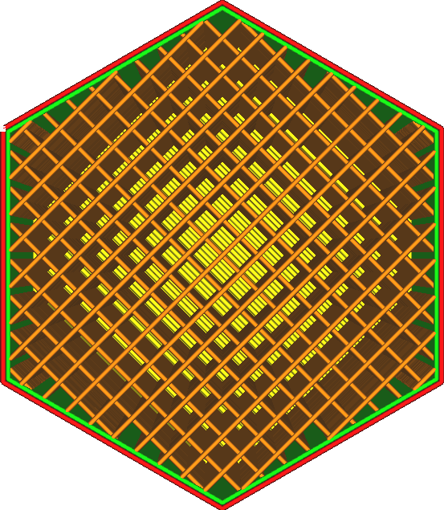
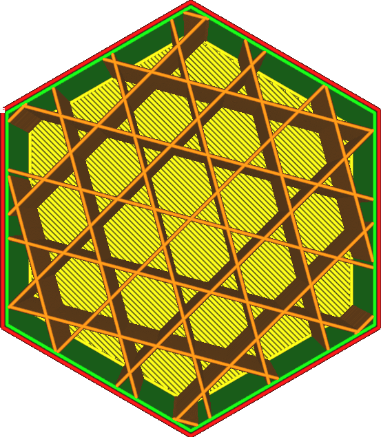
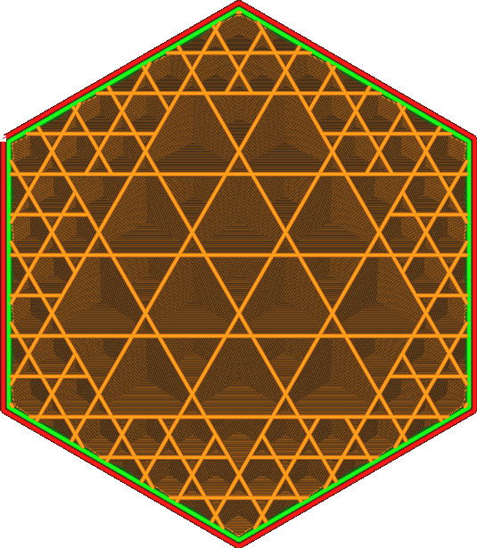
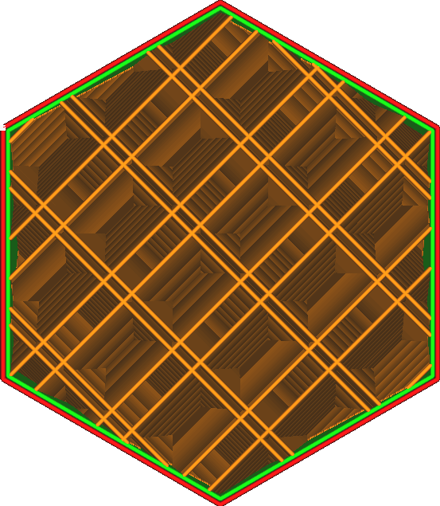
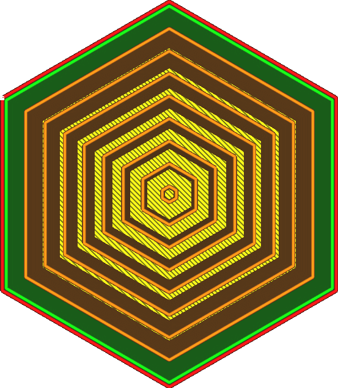
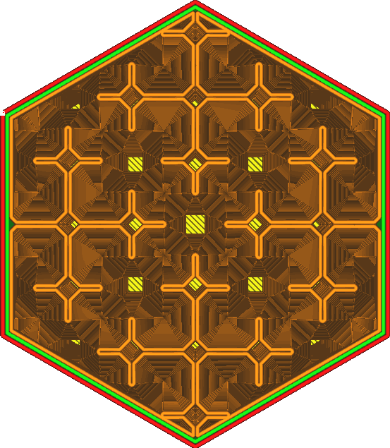

The infill pattern defines a structure that is used to fill the volume of the object. Various patterns are available, each of which has their own advantages. Some are specialised for very specific applications.

Grid
----

The grid infill pattern creates two perpendicular sets of lines. Together this forms a pattern of squares.
* Strongest pattern in the vertical direction.
* Fairly strong in the two directions of the lines.
* Not so strong in the diagonal.
* Very good at supporting the top surface. Your surface will look very smooth.

Lines
----

The lines pattern creates parallel lines. By default, the lines pattern alternates its direction perpendicularly from layer to layer, which makes it look like the grid pattern at first glance. However this can be altered with the [Infill Line Directions](infill_angles) setting.
* The best pattern for a smooth top surface together with zigzag, since the distance between the lines is smallest.
* Tends to be weak in the vertical direction, because the layers only have small points in which they bond together.
* Will be extremely weak in the horizontal direction, except in the one direction that the lines are oriented. But even in that direction, it is not resistant to shear so it will fail fairly quickly under load.

Triangles
----

The triangles pattern creates three sets of lines in three different directions. Together this forms a pattern of triangles.
* Very resistant to shear.
* Approximately equal strength in every horizontal direction.
* Top lines have to bridge fairly long, requiring many top skin layers to get an even top surface.
* Flow gets significantly interrupted at intersections, resulting in relatively low strength at high infill rates.

Tri-hexagon
----

The tri-hexagon pattern creates three sets of lines in three different directions, just like the triangles pattern, but offset from each other so that they don't all intersect in the same position.
* Strongest pattern in the horizontal direction.
* Approximately equal strength in every horizontal direction.
* Very resistant to shear.
* Top lines have to bridge very long, requiring many top skin layers to get an even top surface.

Cubic
----

The cubic pattern creates cubes, a 3-dimensional pattern. The cubes are oriented standing on a corner, which allows printing them without overhanging internal surfaces.
* Approximately equal strength in every direction, including the vertical direction.
* Fairly strong in every direction.
* Reduced effect of pillowing, since it doesn't produce long vertical pockets of hot air.

Cubic Subdivision
----

The cubic subdivision pattern creates cubes, a 3-dimensional pattern. The cubes are oriented standing on a corner, which allows printing them without overhanging internal surfaces. However this pattern will produce bigger cubes towards the inside of the volume, which saves on material. It leaves out the infill lines in places where they are least useful.

This pattern may produce infill densities that are lower than desired. It is advisable to increase the infill density drastically when using this pattern. The optimisation works best at high infill rates.

Algorithmically, this pattern is generated by creating one giant cube around the entire volume, then subdividing this cube into 8 sub-cubes when it hits any walls. This is then recursed, so the sub-cubes that hit any walls are subdivided again and again. This repeats until the infill line distance is reached.
* Strongest pattern by weight and printing time.
* Approximately equal strength in every direction, including the vertical direction.
* Concentrates infill in thin pieces.
* Reduced effect of pillowing, since it doesn't produce long vertical pockets of hot air.
* If using increased infill density, the infill doesn't shine through walls much, producing a better surface quality for equal printing time.
* Introduces retractions, which doesn't work well with flexible or runny materials.
* Takes longer to slice.

Octet
----

The octet pattern creates a combination of regular tetrahedra and cubes, a 3-dimensional pattern. Every so often, multiple infill lines will be placed adjacent to each other.
* Creates a strong internal frame where multiple parallel lines touch. Load is quickly dissipated towards this internal frame.
* Strong on models with a medium thickness of about a centimetre.
* Reduced effect of pillowing, since it doesn't produce long vertical pockets of hot air.
* Results in a very long bridging distance for top skin, which reduces top surface quality.

Quarter Cubic
----

The quarter cubic pattern creates a 3-dimensional tesselation consisting of tetrahedra and truncated tetrahedra. Every so often, multiple infill lines will be placed adjacent to each other.
* Creates two disjunct internal frames, similar to octet, where multiple parallel lines touch. Load is quickly dissipated towards this internal frame. The frames are oriented in two different directions, making them weaker individually but reducing the distance to distribute the load to these frames.
* Strong on models with a low thickness of a few millimetres.
* Reduced effect of pillowing, since it doesn't produce long vertical pockets of hot air.
* Results in a very long bridging distance for top skin, which reduces top surface quality.

Concentric
----

The concentric pattern creates rings parallel to the walls.
* The strongest infill pattern when using 100% infill, since not only will no lines intersect, but the lines are also oriented in a way that the non-isotropic strength of lines will distribute the load.
* Produces the most flexible prints, with a very weak and even strength in all horizontal directions.
* Stronger in the vertical direction than in the horizontal direction.
* With 100% infill density, the material could clump up in the middle, reducing reliability of printing round shapes where the concentric circles come together in one point.
* With some shapes, some of the infill lines could hang in mid-air, adding no additional strength for the cost of material and printing time.
* When not using 100% infill, this is the weakest infill pattern in the horizontal direction. It adds no strength at all.

Zigzag
----

The zigzag infill pattern causes the nozzle to draw lines in a zig-zag fashion. This is like lines, but the lines are connected in one long line, which prevents flow interruptions.
* The second-strongest infill pattern when using 100% infill. However, it prints more reliably than concentric infill with round shapes.
* The best pattern for a smooth top surface together with zigzag, since the distance between the lines is smallest.
* Tends to be fairly weak in the vertical direction, since the layers only have small points in which they bond together.
* Will be extremely weak in the horizontal direction, except in the one direction that the lines are oriented. But even in that direction, it is not resistant to shear so it will fail fairly quickly under load. 

Cross
----

The cross infill pattern produces a space-filling curve that produces something that looks like crosses along the inside of the volume.
* Evenly squishy in all horizontal directions, making this useful for printing soft and flexible objects.
* Produces no long straight lines in the horizontal direction, making this evenly squishy along the entire perimeter. There are no strong spots.
* Produces no retractions at all, making this easier to print with flexible materials.
* Will be stronger in the vertical direction than in the horizontal direction.
* Takes a long time to slice.
* Will be very weak in all horizontal directions.

Cross 3D
----

The cross 3D infill pattern produces a space-filling curve that produces something that looks like crosses along the inside of the volume. This pattern pulses along the Z axis in order to make it weaker in the vertical direction.
* Approximately evenly squishy in all directions, horizontal and vertical, making this the most useful pattern for printing soft and flexible objects.
* Produces no long straight lines, making this evenly squishy along the entire surface.
* Produces no retractions at all, making this easier to print with flexible materials.
* Takes a long time to slice.
* Will be very weak in all directions. 

Gyroid
----

The gyroid infill pattern produces a wavy pattern that alternates directions.
* Produces one volume which is completely permeable to fluids, making this a useful pattern for dissolvable materials.
* Equally strong in all directions, but not very strong. This makes it useful for flexible materials, but the result will be somewhat harder, less squishy, than the Cross (3D) infill patterns.
* Resistant to shearing.
* Takes a long time to slice and produces large g-code files.