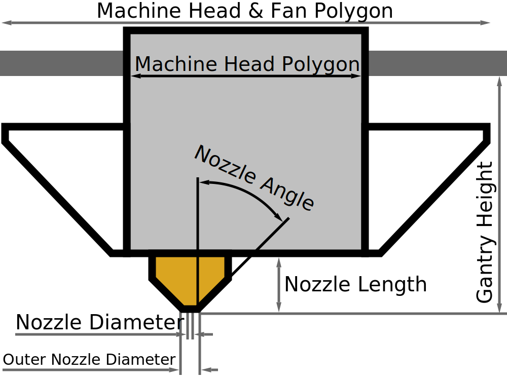

Machine Head & Fan Polygon
====
This setting tells Cura what the shape of your print head is, as seen from the top. This is necessary to prevent collisions when printing in [one-at-a-time mode](../blackmagic/print_sequence.md).

This setting contains a list of coordinates that form a polygon. The coordinates are relative to the "position" of the head, to which the nozzles are also positioned relatively.

Cura uses this to create a collision area around the objects you're printing in one-at-a-time mode. This collision area prevents you from placing objects too close to one another such that they can't be printed without the print head hitting the previously printed model. The collision area is not the same shape as the print head itself though: It will be a convex hull around the print head to prevent collisions during travel moves as well. It will also be shrunk to be symmetric. For instance, if the nozzle is more towards the left side of the print head (as in the above picture) then the collision area will be shrunk such that another object may be placed close to the right side of previously printed objects. The order in which these objects are printed will then be adjusted so that they can be printed without collisions.

**Since this is a machine setting, it will not normally be listed in the normal list of settings. However the size of the print head can crudely be written down in the printer settings dialogue, which can be found in the list of added printers in the preferences dialogue. You can only specify the position left, right top and bottom sides of the print head there.**