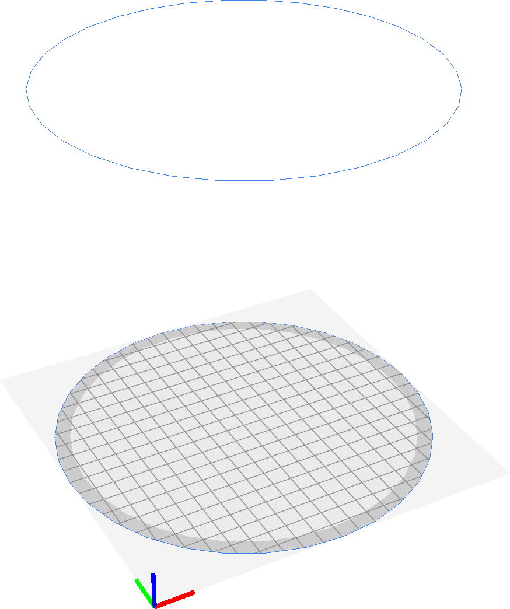

Build Plate Shape
====
With this setting, you can indicate the shape that the printable volume takes in your printer. There are two options: rectangular or elliptic.

Elliptical build volume are common with delta-style 3D printers. If the build plate is elliptical, the [width](machine_width.md) and [depth](machine_depth.md) of the build volume apply to the two radii of the ellipse. Cura will only allow placing objects within the ellipsis, so the total build volume will be smaller, compared to a rectangular build plate with the same dimensions.

**This setting is a machine setting, so it will not appear in the normal list of settings. It can be changed by going to the list of printers in the preferences screen and clicking on "Machine Settings".**