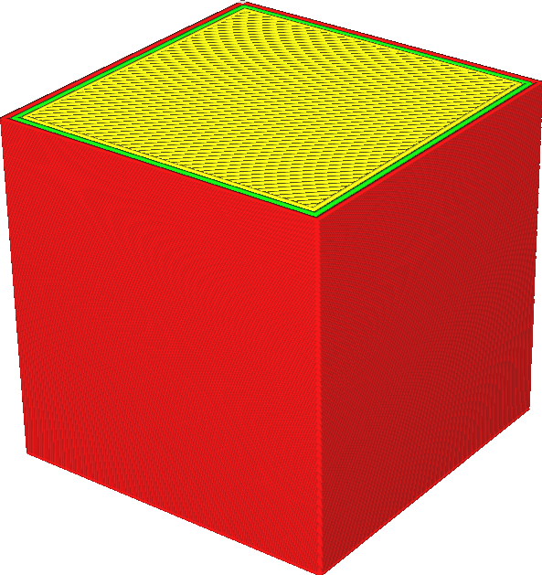
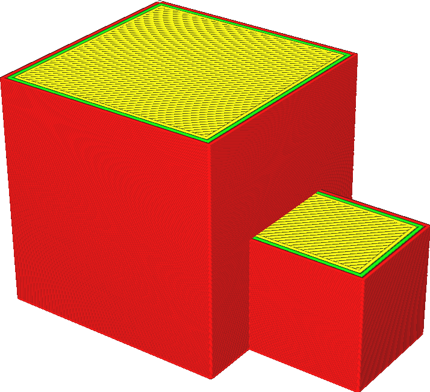

Extensive Stitching
====
Cura needs to know where the inside of the model is in order to fill it with material. If the surface of your model is not precisely closed or has internal walls, it may be ambiguous where the inside of the model is.

A common case of the model not being manifold, is when an extra piece of the model is attached to an otherwise closed part. This is common when editing meshes with CAD software that was not designed for manufacturing (but only for digital rendering) such as Blender or SketchUp. You can see an example of this in the images below.

<!--screenshot {
"image_path": "meshfix_extensive_stitching_xray.png",
"models": [{"script": "external_attachment.py"}],
"camera_position": [62, 87, 68],
"layer": -1
}-->
<!--screenshot {
"image_path": "meshfix_extensive_stitching_disabled.png",
"models": [{"script": "external_attachment.py"}],
"camera_position": [62, 87, 68],
"settings": {
    "meshfix_extensive_stitching": false
},
"colours": 32
}-->
<!--screenshot {
"image_path": "meshfix_extensive_stitching_enabled.png",
"models": [{"script": "external_attachment.py"}],
"camera_position": [62, 87, 68],
"settings": {
    "meshfix_extensive_stitching": true
},
"colours": 32
}-->

This setting causes Cura to make a better attempt at closing gaps in the mesh if it is not properly watertight. This increases the chances of a good print, but increases slicing time and may sometimes connect the wrong surfaces together.