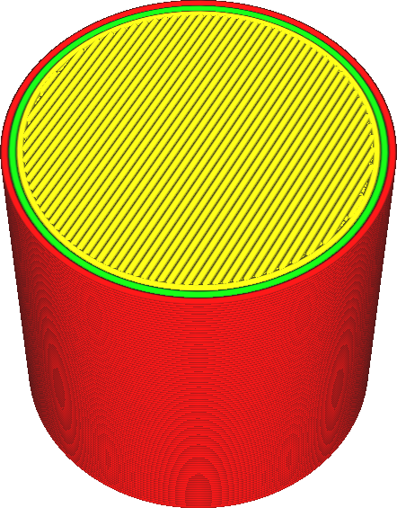
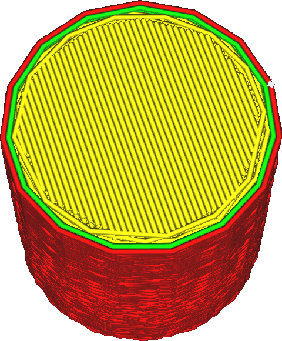

Maximum Deviation
====
While high resolution input may seem better at first, quite often the printer doesn't deal with high resolution g-code very well. Therefore Cura will reduce the resolution of its input during the slicing process. This setting determines how far the reduced path may deviate from the original path in order to reduce the resolution.

<!--screenshot {
"image_path": "meshfix_maximum_resolution_0.05.png",
"models": [{"script": "cylinder.scad"}],
"camera_position": [40, -20, 116],
"settings": {
    "meshfix_maximum_resolution": 0.05
},
"colours": 64
}-->
<!--screenshot {
"image_path": "meshfix_maximum_resolution_1.png",
"models": [{"script": "cylinder.scad"}],
"camera_position": [40, -20, 116],
"settings": {
    "meshfix_maximum_resolution": 4,
    "meshfix_maximum_deviation": 0.5
},
"colours": 64
}-->

The printer needs to process the g-code while it's being executed. If the g-code contains many tiny line segments, the print head may race through the motion so fast that the processor of the 3D printer is unable to keep up. This has the effect that the print head will sporadically slow down to allow the CPU to catch up or plainly to wait for the next motion command. This causes the surface to become very rough or even to show small blobs because the flow rate out the nozzle doesn't perfectly match the sporadic movement of the nozzle. Sometimes a lower resolution results in better print quality.

This setting indicates how far the new, resolution-reduced path is allowed to deviate from the original high resolution path. Lines are considered to be joined with other line segments if they are shorter than the [Maximum Resolution](meshfix_maximum_resolution.md), but if this shortcut would cause the path to deviate more than the distance indicated by this setting, the lines won't be joined.

Note that it is not guaranteed that the same vertices are removed from every layer if the vertices happen to align. The resolution reduction is performed in 2D by removing vertices of the shapes of the layer, not in 3D by removing vertices of the mesh. As a result, reducing the resolution too much will often lead to an irregular surface, rather than an angular surface.

For structural integrity it is strongly recommended that the paths are not allowed to deviate by more than half a line width. However if the surface needs to be smooth or look nice, this setting basically indicates how deep the irregularities on the surface are allowed to be. The maximum deviation needs to be very low then as to not be seen by the naked eye.

However reducing the maximum deviation too much limits the resolution reduction a lot. The resulting g-code may not print well then since the CPU is not able to catch up with the short movement commands.