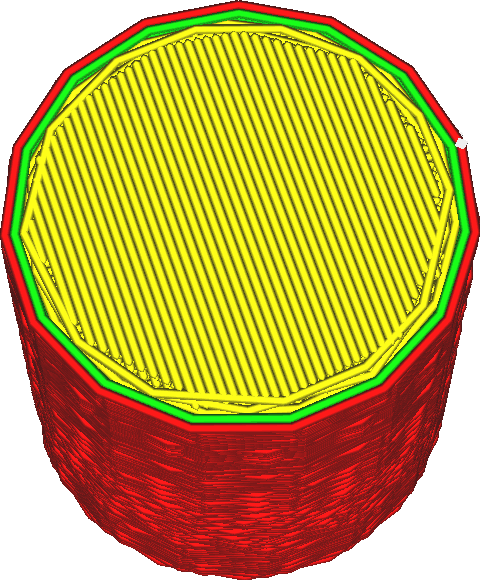

While high resolution input may seem better at first, quite often the printer doesn't deal with high resolution g-code very well. Therefore Cura will reduce the resolution of its input during the slicing process. This setting determines the resolution that Cura will hold as maximum.

The printer needs to process the g-code while it's being executed. If the g-code contains many tiny line segments, the print head may race through the motion so fast that the processor of the 3D printer is unable to keep up. This has the effect that the print head will sporadically slow down to allow the CPU to catch up or plainly to wait for the next motion command. This causes the surface to become very rough or even to show small blobs because the flow rate out the nozzle doesn't perfectly match the sporadic movement of the nozzle. Sometimes a lower resolution results in better print quality.

This setting indicates a minimum length for line segments. Line segments that are shorter than the specified length will be considered for joining with other line segments. They will then be joined if the new path doesn't deviate from its original path by more than the [Maximum Deviation](meshfix_maximum_deviation.md).

Note that it is not guaranteed that the same vertices are removed from every layer if the vertices happen to align. The resolution reduction is performed in 2D by removing vertices of the shapes of the layer, not in 3D by removing vertices of the mesh. As a result, reducing the resolution too much will often lead to an irregular surface, rather than an angular surface.

It is recommended to reduce the resolution of the model such that the print head doesn't slow down significantly to let the CPU catch up. If the resolution is not reduced enough, the surface will get rough by the print head reducing its speed while extrusion continues. If the resolution gets reduced too much, the surface will also get rough by the walls not stacking up exactly everywhere.