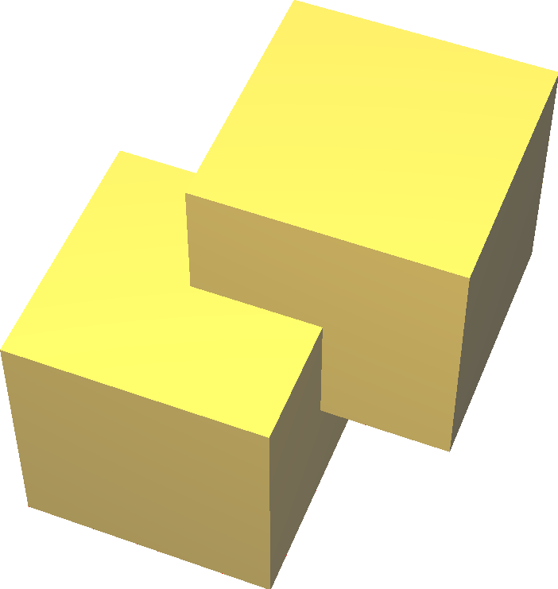

Union Overlapping Volumes
====
If a model contains multiple volumes that intersect, the volume that is inside both volumes will normally not get filled. This setting causes Cura to ignore the internal structures and just fill all of them, regardless of how many shells are around the volume.

In technical terms, this setting effectively changes the winding rule from [Even-Odd](https://en.wikipedia.org/wiki/Even%E2%80%93odd_rule) to [Nonzero](https://en.wikipedia.org/wiki/Nonzero-rule). Normally, a volume gets filled if it is surrounded by an odd number of shells. With this setting enabled, it gets filled if it is surrounded by a non-zero number of shells.

*This only works for volumes within the same model. If you've loaded multiple files and made them intersect in Cura, this setting will not have an effect. See the setting Remove Mesh Intersection to fix issues with multiple separate meshes overlapping.*