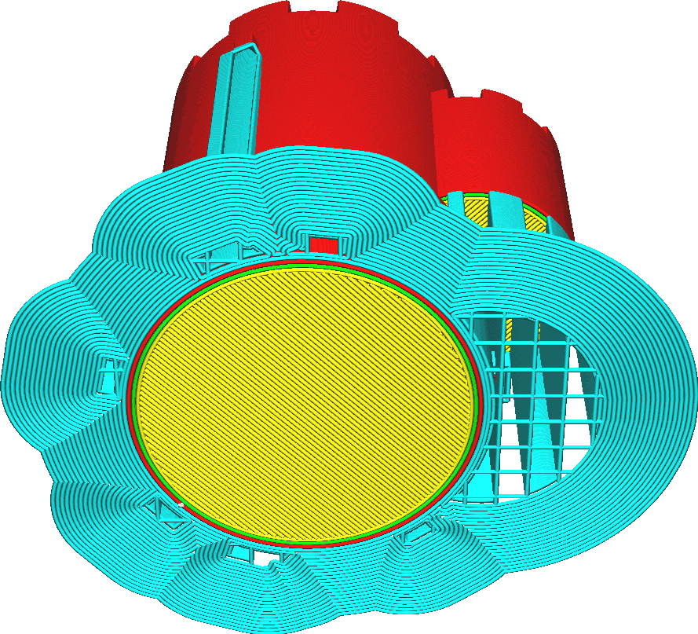
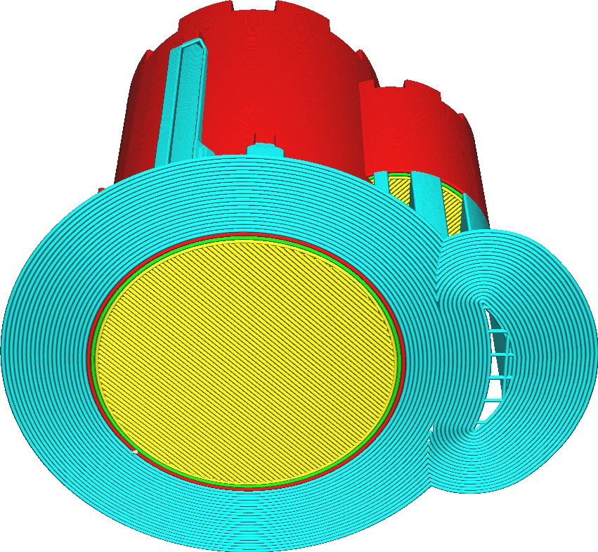

Brim Replaces Support
====
If this setting is enabled, the brim will continue to follow the model underneath support, instead of going around the support. The support will then be printed on top of the brim, in the next layer. There will also still be a brim around the support.

<!--screenshot {
"image_path": "brim_replaces_support_disabled.png",
"models": [{"script": "castle.scad"}],
"camera_position": [0, 100, -136],
"settings": {
    "adhesion_type": "brim",
    "support_enable": true,
    "brim_replaces_support": false
},
"colours": 64
}-->
<!--screenshot {
"image_path": "brim_replaces_support_enabled.png",
"models": [{"script": "castle.scad"}],
"camera_position": [0, 100, -136],
"settings": {
    "adhesion_type": "brim",
    "support_enable": true,
    "brim_replaces_support": true
},
"colours": 64
}-->

Enabling this setting will make the brim follow the model better. As a result, the model is kept down to the build plate better, which prevents warping.

In some cases, this will reduce the total width of the brim for some pieces of support. However in those cases, the support will be close enough to the model that the brim merges with that of the model, so it will hardly be a problem of adhesion there.