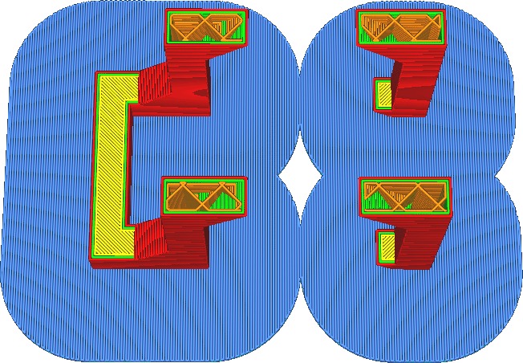
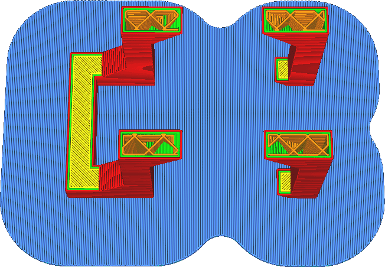

Raft Smoothing
====
With this setting, inside corners of the raft can be made smoother. The setting specifies the radius of an arc. All inside corners that are sharper than the specified arc radius will get smoothed to have the arc radius.

The technical term for this is a [morphological closing operation](https://en.wikipedia.org/wiki/Closing_\(morphology\)). All holes smaller than the specified radius will be closed. The sharpest inside corners will not be made as sharp any more.

The function of this setting is to make the raft stiffer. When multiple pieces are connected through thin connections, the raft can bend at those places. This makes them less stiff and less resistant against warping. Increasing this setting will make separate pieces better connected, making the raft stronger. The surface area of the raft will be bigger, so the raft will stick better. Moreover, the raft will have a smaller circumference in total, reducing the places where warping can start. In total, there should be less warping.

However the total volume of the raft will also be increased. This uses more material and takes more time to print, especially since the raft is normally printed very slowly.