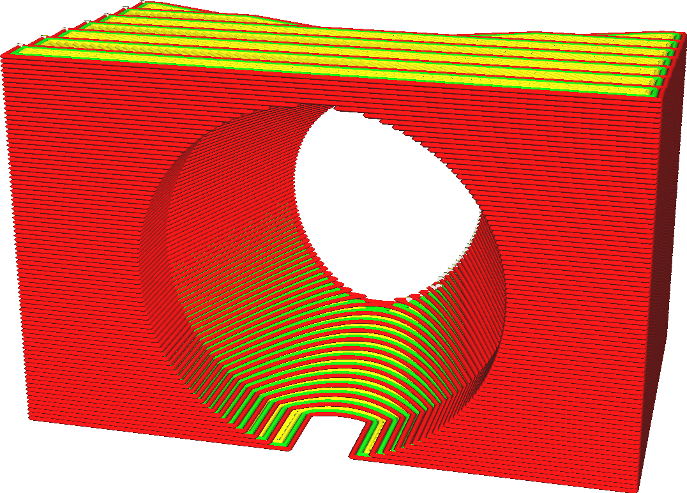

Layer Height
====
The 3D printer puts down plastic in layers. The layer height is the thickness of these layers in millimetres. It is the most important factor in both the visual quality of your final print and the printing time.

<!--screenshot {
"image_path": "layer_height_0.1.png",
"model_path": "plunger_stop.scad",
"camera_position": [25, 100, 50],
"camera_lookat": [0, 0, 12.5],
"layer": 9999,
"line": 0,
"settings": {
    "layer_height": 0.1,
    "adhesion_type": "none"
},
"colours": 32
}-->
<!--screenshot {
"image_path": "layer_height_0.3.png",
"model_path": "plunger_stop.scad",
"camera_position": [25, 100, 50],
"camera_lookat": [0, 0, 12.5],
"layer": 9999,
"line": 0,
"settings": {
    "layer_height": 0.3,
    "adhesion_type": "none"
},
"colours": 32
}-->

Layer height is the single most important setting to affect the overall quality and conversely the printing time. These are just some of the effects:
* Having thinner layers will increase the visual quality of the print. Since the layers are thinner, the stair stepping effect at the layer's borders will be reduced. Also, the layers will be closer together and so the creases in between the layers will be smaller, leading to an overall smoother finish.
* Having thinner layers allows the printer to produce more detail on the top and bottom sides of your print.
* Having thicker layers tends to make the print stronger, to a point. There will be fewer borders between the layers, which tend to be a weak point. The thicker layers will not shear as much.
* Having thicker layers will reduce printing time, because the nozzle will not have to make as many horizontal movements.

Layer height vs. profiles
----
Many settings depend on the layer height. Because layer height significantly affects the flow rate of material through the nozzle, many parameters of the printing process will change. This is very complex. For instance, when increasing the layer height, you should probably increase the printing temperature slightly to offset the extra rate of heat loss. The temperature then affects the liquidity of the material which will affect how sharp your corners will be and what cooling is needed, and so on. It is always wise to start from a pre-made quality profile available to your printer that has a layer height close to what you want.

You can choose a desired layer height in Custom Mode, but pre-made profiles are available with various layer heights as well. You can choose from profiles for various layer heights in the Recommended Mode using a slider or using the drop-down widget in Custom Mode. Since these profiles also change some parameters that depend on the layer height, you'll probably achieve a better quality that way.

Additional notes
----
At very low layer heights, you could run into the resolution limit of your Z axis. Look up the step size of your printer's Z axis and make sure that the layer height is a multiple of this. If it doesn't match up properly, some layers will be thicker than others which will result in banding.

**Note that the layer height setting does not hold for the initial layer of the print or for the raft layers, which have their own settings to adjust the layer height separately. When using adaptive layers, this layer height setting will be used as a baseline but the actual layer height will have some variation.**