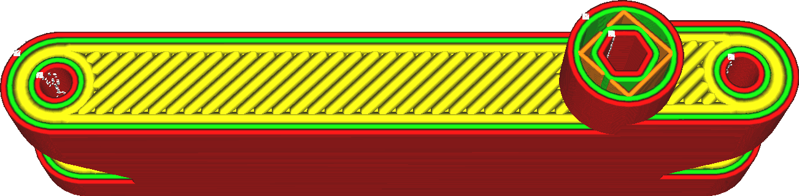

Top/Bottom Line Width
====
The width of every line of the top and bottom being drawn. The width of a line can be different from the nozzle size simply by extruding more or less material than needed. If more material is extruded, the plastic will flow towards the sides, making the line thicker. If less material is extruded, the surface tension of the material tends to pull the material towards the centre line of the nozzle's path.

Making the skin lines wider is an easy way to reduce printing time, because fewer lines will be necessary to print the top and bottom sides of the object. However increasing it too much can cause great extrusion fluctuations. This will cause underextrusion when printing the skin and overextrusion when printing whatever comes next, because the flow through the nozzle cannot adjust fast enough. Increasing the skin line width will also increase the chance of holes to appear in the surface, which is not pretty and prevents it from being water tight.

Reducing the width of the skin lines tends to produce a nicer top surface, but at great cost of printing time. It is often more effective to use a different technique such as [Ironing](../shell/ironing_enabled.md) or only adjusting the [Top Surface Skin Lines](../experimental/roofing_line_width.md).