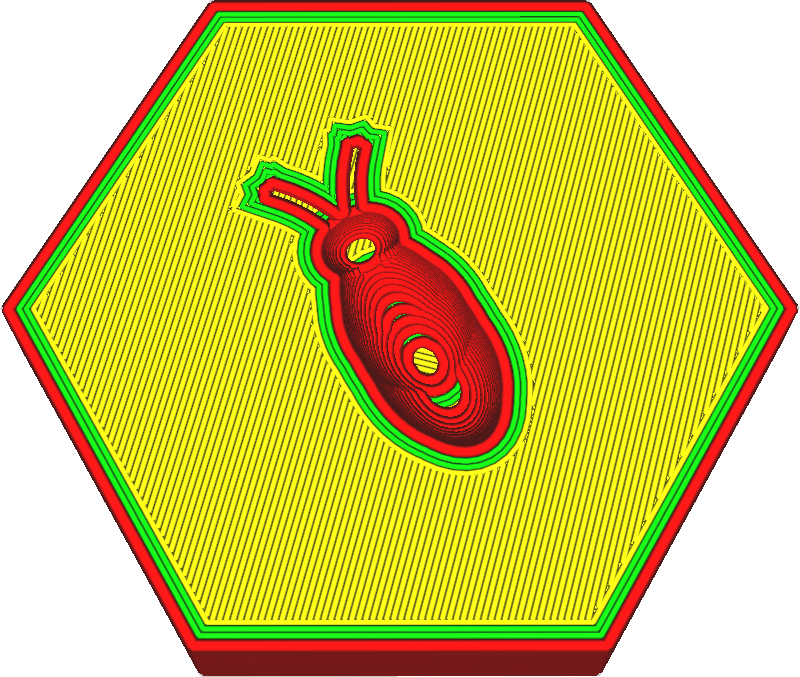

The line width for the outer wall can be adjusted separately from the inner walls. This setting indicates how wide the outer wall line will be.

Reducing the outer wall to a line width slightly below the nozzle size is known to be beneficial for strength. The nozzle will extrude slightly less material but its opening will overlap with the adjacent inner wall. This causes the material to be pushed aside by the previously-placed wall into its proper location. But that will also cause the plastic to fuse better to the adjacent walls. This allows the outer wall to fuse better to the inner walls, so that they can combine their strength. This greatly improves the strength of the walls.

Reducing the outer wall line width also allows the nozzle to print finer details, because the thinner line will fit better into small details.

Increasing the outer wall line width can reduce printing time. You can achieve a wall with similar thickness with fewer inner walls. The strength will still be reduced somewhat because the outer wall will not fuse as well to the inner walls.

Making lines fit
----
When printing thin parts, adjusting the wall line width settings is an important tool to get accurate and strong parts. Cura will only ever draw complete contours, so if a contour doesn't fit a gap will fall into the walls, which greatly compromises the strength and accuracy of the part.

Cura will attempt to fill such gaps between walls if [Fill Gaps Between Walls](fill_perimeter_gaps.md) is enabled, but that technique is less than ideal for arbitrary shapes and often takes a lot of printing time. When two walls overlap, the [Compensate Wall Overlaps](travel_compensate_overlapping_walls_enabled.md) feature will reduce the wall line width to make sure that the part is dimensionally accurate, but this incurs flow changes which reduce the quality and strength of the print as well.

For an ideal fit you want the part to be an exact multiple of the wall line width so that the walls fit precisely within the part. If you know how wide your part is, this can easily be done by adjusting the width of the walls. First you see how many contours you want to fit such that the lines still have a reasonable width. Then you can see how much you need to adjust the wall line width to make the lines fit properly. Keep in mind that you can adjust the [Outer Wall Line Width](wall_line_width_0.md) and [Inner Wall Line Width](wall_line_width_x.md) separately. Count carefully how many times each type of wall will be drawn to predict the effect of changing the wall line width.

Fitting wall lines is an important skill for 3D printing that distinguishes expert 3D printer operators from the rest. Some practice is required.