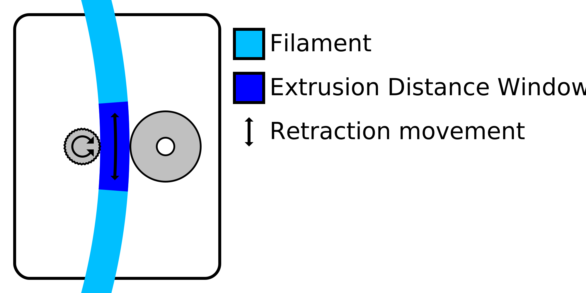

The feeder wheel needs to grip into the filament in order to move it properly. Retracting the material often tends to cause the feeder wheel to wear down the filament to the point where it can no longer grip the filament properly. This setting limits the number of retractions within a certain length of filament in order to prevent this grinding.

The setting indicates how often the filament is allowed to be retracted during the length of filament indicated by the [Minimum Extrusion Distance Window](retraction_extrusion_window) setting. Any further retractions during this window will not retract, but just travel without retracting.

The length of filament during which the number of retractions is limited is a sliding window. For instance, with a window length of 3mm and a maximum retraction count of 10, this means that a new retraction is allowed as soon as the 10th retraction previous was made farther than 3mm back on the filament.

Reducing the maximum retraction count will reduce grinding on the filament. This is useful for softer materials, such as PVA. However it will also increase stringing, because it will no longer retract in a position where this was apparently desired.