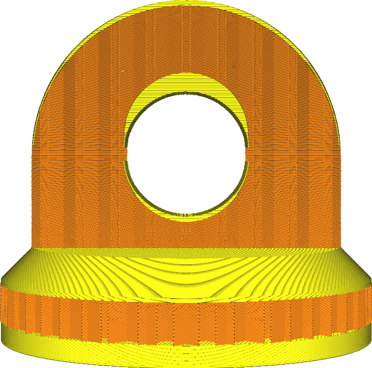

Bottom Layers
====
With this setting you can set the number of solid bottom layers of the print. A higher value ensures all gaps on the bottom layers are closed completely. However, this can also increase the print time and amount of filament used.

<!--screenshot {
"image_path": "top_bottom_thickness_0.8.png",
"models": [{"script": "stamp.scad"}],
"camera_position": [0, 203, 30],
"settings": {
    "wall_line_count": 0,
    "top_bottom_thickness": 0.8
},
"colours": 64
}-->
<!--screenshot {
"image_path": "bottom_thickness.png",
"models": [{"script": "stamp.scad"}],
"camera_position": [0, 203, 30],
"settings": {
    "wall_line_count": 0,
    "bottom_thickness": 3
},
"colours": 64
}-->

* Increase to improve strength.
* Increase to close gaps on the bottom side of your print.
* Reduce to shorten printing time and material usage.