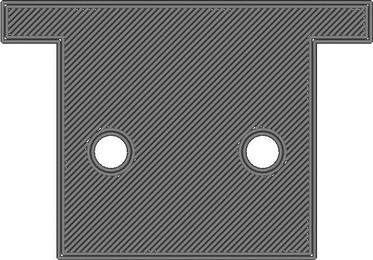
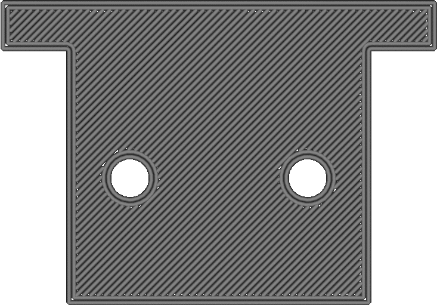

Wall Ordering
====
This setting determines which walls are printed first, printing them from the outside in, or from the inside out.

<!--screenshot {
"image_path": "outer_inset_first_disabled.gif",
"models": [{"script": "calendar_holder.scad"}],
"camera_position": [0, 0, 120],
"settings": {
    "skin_outline_count": 0,
    "inset_direction": "inside_out"
},
"layer": 2,
"line": [0, 6, 12, 18, 25, 35, 41, 47, 54, 57, 61, 64, 65, 68, 72, 74, 77, 79, 80, 82, 86, 96, 102, 108, 114, 125, 131, 137, 144],
"delay": 125,
"colours": 32
}-->
<!--screenshot {
"image_path": "outer_inset_first_enabled.gif",
"models": [{"script": "calendar_holder.scad"}],
"camera_position": [0, 0, 120],
"settings": {
    "skin_outline_count": 0,
    "inset_direction": "outside_in"
},
"layer": 2,
"line": [0, 6, 12, 18, 25, 35, 41, 47, 54, 58, 61, 63, 64, 66, 70, 72, 76, 79, 80, 83, 88, 97, 103, 109, 116, 125, 131, 137, 144],
"delay": 125,
"colours": 32
}-->

This setting has a small effect on quality as well as dimensional accuracy:
* Printing from outside inwards will improve dimensional accuracy. Adjacent walls generally push each other a bit, especially if the wall line width is smaller than the nozzle size. The wall that gets printed first will have been solidified and then doesn't get pushed as much. Therefore printing the outer wall first will make your outer wall be in a more accurate location.
* If the infill is printed before the walls, printing from the outside in will reduce how much the infill shows through on the surface. Otherwise the infill is printed first, then the inner walls which get pushed outwards by the infill, and then the outer wall which gets pushed outwards by the inner walls. As a result, a pattern could be visible on the outside. If the outer wall is printed first, the outer wall can solidify before the inner wall is able to push on it.
* Printing from the inside out is better for overhang. The outer wall is further removed from the previous layer than the inner wall. When printing the outer wall first, the outer wall has nothing yet to grab on to. When the inner wall is printed first, the outer wall can attach sideways to the outer wall.

When there is an odd number of walls, the wall in the centre will always be printed last.