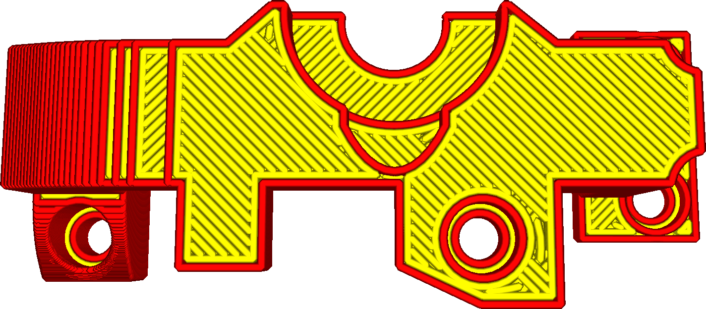

Ironing causes the printer to do another pass over the top surface in order to make it extra smooth. This extra pass has a very small line width and prints extra slow.

Ironing will print a line pattern on top of the top surface of your print. This has two major benificial effects:
* It melts the top surface again by going over it multiple times with a hot nozzle. This is where the name "Ironing" comes from. Because the movement speed is so low and the line width is so small, the nozzle will heat up the surface significantly. The flat part of the nozzle then strokes it smooth.
* It fills in gaps in the top surface. The ironing motion is done at the same height as the layer itself. It has less flow than a full layer, but still has some flow. In theory, this flow has nowhere to go, but in practice it will keep pressure inside the nozzle chamber. Whenever the nozzle passes over an unevenness in the surface, the material in the nozzle will flow into that gap.

However, ironing comes with some disadvantages as well:
* It increases printing time significantly.
* If the ironing pattern has interruptions (because it has to travel to different parts), it will leave a visible line between the part that was ironed earlier and the part that was ironed later. This can sometimes be avoided by setting the [Ironing Pattern](ironing_pattern.md) to a different pattern, such as Concentric.
* Sloped surfaces, or top surfaces with lots of detail, may get ironed as well, which increases the topography effect. The borders between the layers become more pronounced. This can be prevented by enabling [Iron Only Highest Layer](ironing_only_highest_layer.md).