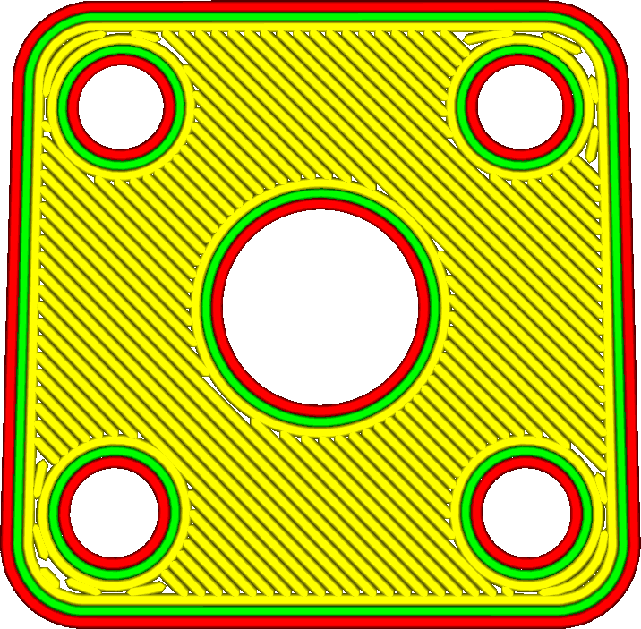
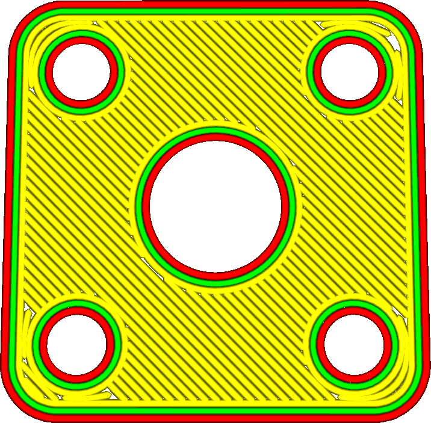

Skin Overlap
====
This setting makes the skin overlap a bit with the adjacent structures. This makes the skin adhere better to those structures.

This overlap technically produces overextrusion, but the amount of overextrusion is small enough that it won't be visible. It will have a significant influence on the strength though, because the skin can adhere better to the walls and infill. After all, these structures only add to the strength of the model if they have something to hold on to.

Having a bit of overlap can also help to reduce the occurrence of gaps in the skin.