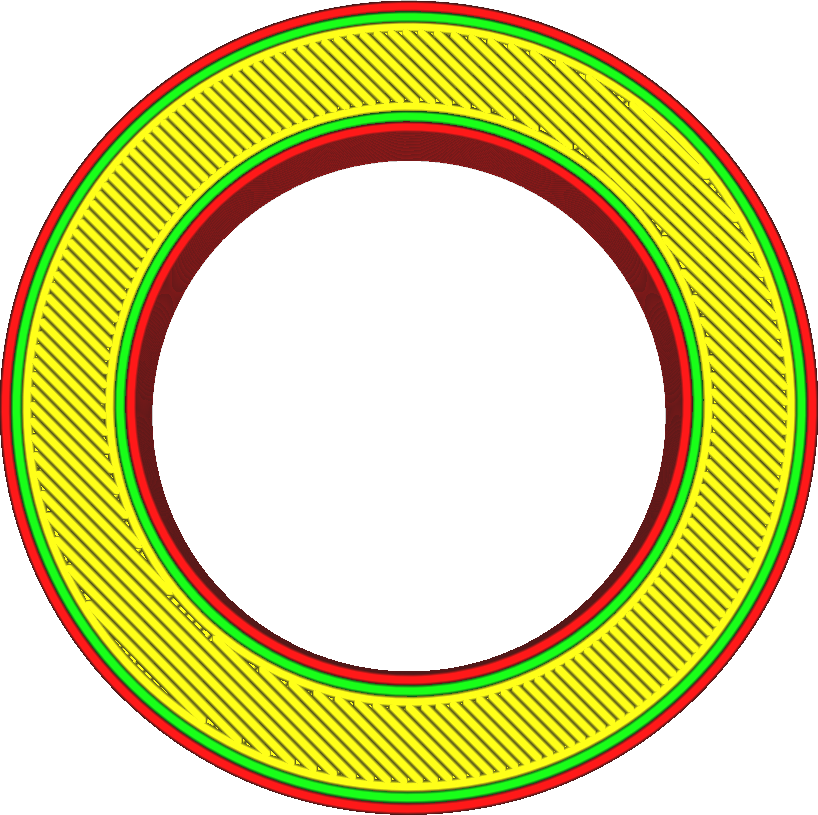
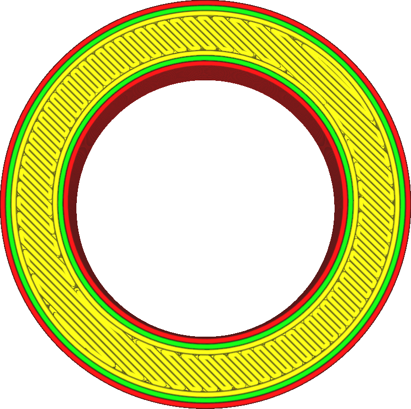

This setting allows you to choose how the top and bottom surfaces get filled up with material. Several different printing patterns are available, but the patterns here are more limited than for infill. Only patterns that create solid layers are available.

Lines
---

The basic lines pattern draws straight lines across the surface. These lines are oriented by default such that they are well supported by the infill and support. The direction of the lines alternates between layers.
* Provides a nice surface quality.
* Very rigid in the directions that the lines are drawn.
* Adheres strongly to the walls, creating relatively strong parts.

Concentric
----

The concentric pattern continues drawing contours towards the inside of the model.
* Equally strong in all directions.
* Prevents creating air pockets and gaps. It's easier to create water-tight objects with this pattern.
* Great overhang quality, because the lines tend to bridge very well.
* If the part is circular, this can create a nasty spot in the centre where the contours converge.
* Surface quality is less than ideal.

Zigzag
---

The zigzag pattern is very similar to the lines pattern, but instead of ending the lines in the walls it will continue extruding towards the next skin line.
* Provides a great surface quality.
* Very rigid in the directions that the lines are drawn.
* Keeps the extrusion rate more constant, which improves the consistency of the surface for materials that extrude more difficultly.
* Doesn't stick as well to the walls as the lines pattern. The effect of the [Skin Overlap](skin_overlap.md) is reduced. This makes the part weaker and reduces the quality of overhangs.