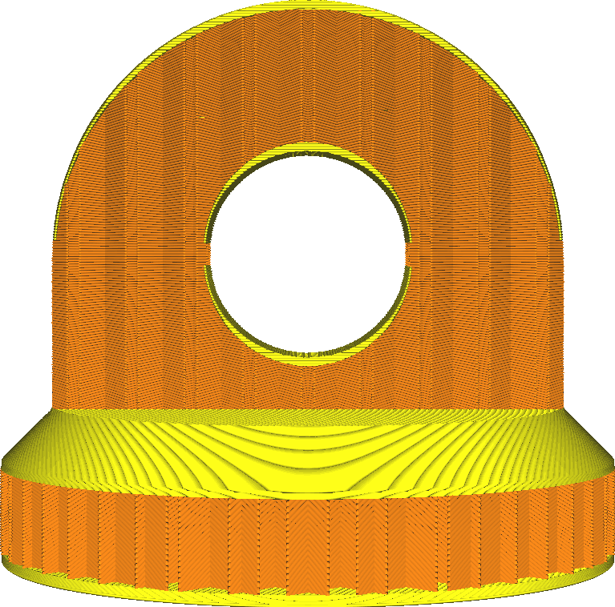

Top Thickness
====
This setting configures how thick the solid top side of the print will be. This solid layer is printed instead of the sparse infill. It is intended to close the top side.

A thicker top side will have several effects, beneficial for the quality of the top surface but detrimental to productivity.
* Your part will be stronger. Having a thicker top side will mean that a smaller part of your print will get filled with the sparse infill pattern. Instead it gets made completely solid.
* The top surface will be smoother. Any pillowing and sagging in the top skin will get smoothed out in the additional layers.
* It's more likely that your model will be water tight. A thicker top side top side will provide more layers to block water or other fluids from getting in, since more layers are filled completely.
* Your print will use more material, since more layers are filled completely.
* Your print will take longer, since more material must be placed down and these layers are normally printed more slowly than the infill.