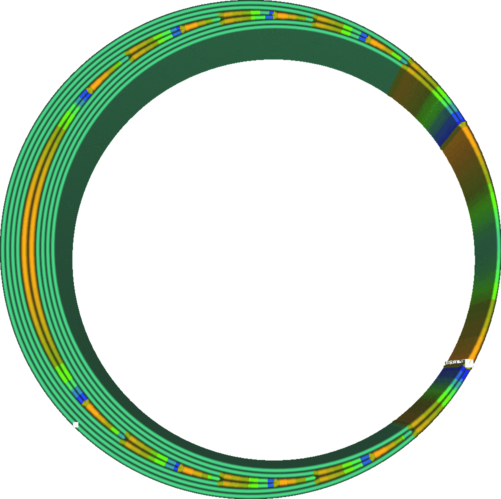
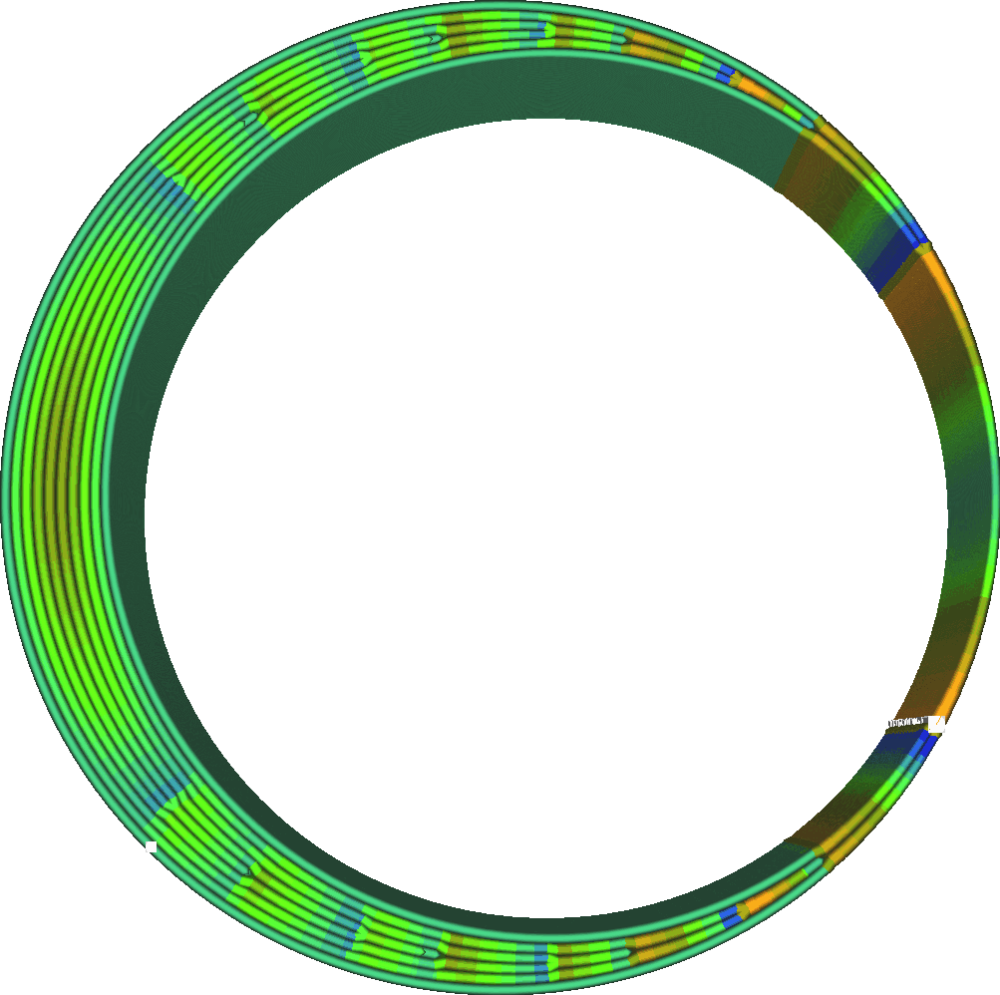

Wall Distribution Count
====
Cura can adjust the width of wall lines to better fit the shape you're printing, but it doesn't have to adjust every wall by the same amount. It prefers to change the width of walls further towards the inside of the model. This setting determines the number of walls, counting from the inside out, that get adjusted to fit the available space.

<!--screenshot {
"image_path": "wall_distribution_count_1.png",
"models": [
	{
		"script": "misaligned_ring.scad",
		"transformation": ["scale(2)"]
	}
],
"camera_position": [-11, 0, 111],
"settings": {
	"wall_line_count": 5,
	"wall_distribution_count": 1
},
"colour_scheme": "line_width",
"colours": 128
}-->
<!--screenshot {
"image_path": "wall_distribution_count_5.png",
"models": [
	{
		"script": "misaligned_ring.scad",
		"transformation": ["scale(2)"]
	}
],
"camera_position": [-11, 0, 111],
"settings": {
	"wall_line_count": 5,
	"wall_distribution_count": 5
},
"colour_scheme": "line_width",
"colours": 128
}-->

Walls with varying width are harder to print than simple constant-width walls. It takes some time to adjust the flow rate out of the nozzle, and to transition it also needs to make some sharp corners which can cause ringing. All of this is best done as far away from the outside as possible, where it would be visible on the surface of the print. So Cura will concentrate the line width adjustments on the innermost walls.

On the other hand, concentrating the variation also means that those lines in the middle will have widely diverging widths. Spreading that out over more lines means that the amplitude of the variations can be smaller, reducing the impact of variable line width instead of hiding it on the inside.

This setting selects a number of walls from the inside among which the line width can be adjusted to fill the available space. This counts in both directions from the centre, so if this is set to 2, up to 4 walls can be adjusted in the centre. The adjustment is not evenly spread out within those walls either. The walls in the centre will always be adjusted slightly more than walls closer to the outside.

The outer wall is always kept at the nominal line width where possible. This wall is so influential on the print quality that it is kept at a constant line width to make the surface as smooth as possible. Only if the piece becomes so thin that it consists solely out of outer walls will those walls be adjusted.

In practice, hiding the imperfections in the centre is almost always a better strategy than spreading the imperfections over multiple walls. As a result, it's best to keep this setting as low as possible. When working with materials that are difficult to extrude or change the flow of, such as flexible materials, it helps to increase this setting to reduce flow changes. It can never prevent those flow changes entirely though.

**This setting doesn't just apply to normal walls, but also to extra skin walls, support walls, infill walls and concentric patterns.**