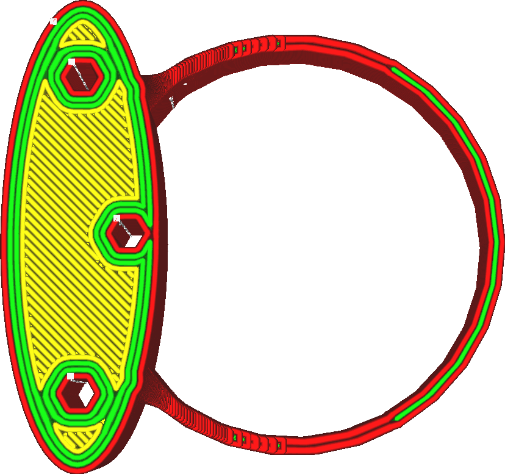

Wall Transitioning Filter Distance
====
Some models have thin pieces hovering around the threshold where different numbers of walls get used. This could make the number of walls alternate back and forth even though the actual width of the piece doesn't vary much. The alternation ruins the print quality, requiring lots of flow changes and adding more travel moves. Using this feature, transitions are removed if it would have transitioned back and forth within a certain distance.

<!--screenshot {
"image_path": "wall_transition_filter_off.png",
"models": [{"script": "signet.scad"}],
"camera_position": [0, 11, 106],
"settings": {
	"wall_transition_filter_distance": 0,
	"wall_transition_filter_margin": 0,
	"wall_line_count": 3
},
"colours": 64
}-->
<!--screenshot {
"image_path": "wall_transition_filter_on.png",
"models": [{"script": "signet.scad"}],
"camera_position": [0, 11, 106],
"settings": {
	"wall_transition_filter_distance": 100,
	"wall_transition_filter_margin": 0.2,
	"wall_line_count": 3
},
"colours": 64
}-->

When a transition gets removed, then temporarily some of the lines can get too wide or too thin, exceeding the [Minimum Wall Line Width](min_wall_line_width.md). After all, there was a transition there to fit better with the width of the part. Without that transition, it will use a lower or higher amount of walls than would be ideal, and the width of those walls will be adjusted accordingly. This is allowed up to the [Wall Transitioning Filter Margin](wall_transition_filter_deviation.md). If the width of the walls varies too much, the transition is not removed.

This filter aims to solve a common problem with thin parts using low resolution 3D meshes. The 3D model, consisting of flat triangles, can't represent a curve exactly but only approximates it. The curve will have edges, with flat surfaces between them. When modelling a curved part with a constant width, it's important that the edges on the outside line up with the edges on the inside. If they don't, the width of the ring varies slightly, which can cause the effect shown above. If it does, the transitioning filter should prevent it from having too much of an effect.

Increasing the distance prevents creating small line segments in some cases. This is quicker to print and can make the surface look smoother. However it also causes more of the print to have extreme line widths, which may not extrude well out of your nozzle. When printing low-resolution models with thin pieces, increasing the distance may help to improve quality. With difficult materials, it's better to stay on the safe side.

**This setting is currently not visible to the user. The filter can only be adjusted using the [Wall Transitioning Filter Margin](wall_transition_filter_deviation.md).**