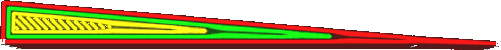

Wall Transition Length
====
In thin parts, not all of the walls fit inside of the shape. If the part is thinner in some places than in others, Cura needs to use different numbers of walls in some places. This setting controls how wide the transitional area will be where it adds or removes one of the walls.

<!--screenshot {
"image_path": "wall_transition_length_0_2.png",
"models": [{"script": "wedge.scad"}],
"camera_position": [-7, 0, 75],
"settings": {"wall_transition_length": 0.2},
"colours": 64
}-->
<!--screenshot {
"image_path": "wall_transition_length_1_5.png",
"models": [{"script": "wedge.scad"}],
"camera_position": [-7, 0, 75],
"settings": {"wall_transition_length": 1.5},
"colours": 64
}-->

The transition area between different numbers of walls always has some slight problems. This is most visible when a single line in the centre ends and the two surrounding walls need to fill the gap. They don't immediately fill the space, and a gap is left. This results in tiny holes on the top and bottom of the prints. The opposite happens when two walls combine into one, causing them to overlap for a moment until they have come together. The overextrusion can lead to dimensional inaccuracy, especially where this occurs in the outer wall. This can all be prevented by making the transition as short as possible.

However, a short transition also causes the nozzle to take some very sharp turns to quickly fill that gap. This results in more ringing, in particular if this occurs for the printing of the outer wall. Making the transition longer reduces accelerations in the nozzle, in particular if this reduces them below the [jerk](../speed/jerk_print.md) limit.

Setting this length to one or two times the line width is a reasonable place to start. Printers with weaker frames or heavier print heads may need to increase it, while printers that can accelerate quickly without ringing can affort to shorten the transition to improve visual quality.