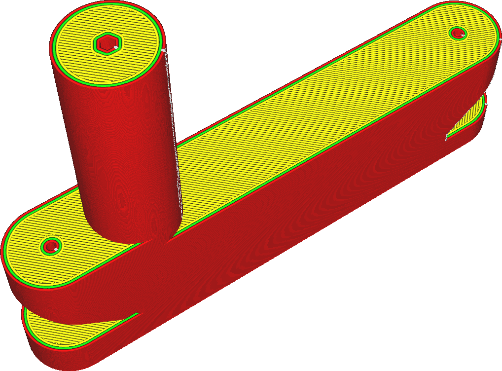

Horizontal Expansion
====
This setting causes the entire model to be slightly wider or slimmer. It is a compensating measure for dimensional inaccuracies of the printing process.

<!--screenshot {
"image_path": "xy_offset_neutral.png",
"models": [{"script": "flipper_grip.scad"}],
"camera_position": [62, -91, 176],
"settings": {"xy_offset": 0},
"colours": 32
}-->
<!--screenshot {
"image_path": "xy_offset_wider.png",
"models": [{"script": "flipper_grip.scad"}],
"camera_position": [62, -91, 176],
"settings": {"xy_offset": 1},
"colours": 32
}-->
<!--screenshot {
"image_path": "xy_offset_slimmer.png",
"models": [{"script": "flipper_grip.scad"}],
"camera_position": [62, -91, 176],
"settings": {"xy_offset": -1},
"colours": 32
}-->

A positive value will make the print fatter. This reduces the size of cavities. A negative value will make the print slimmer and increases the size of cavities.

If the tolerance of a print is important, this setting can be very useful. Due to a slight deformation of plastics, the actual dimensions of the print may not completely correspond with the dimensions of the digital model. Gain errors can be compensated for by simply scaling the model on the build plate with the scale tool, but offset errors due to the print method can be compensated for with this setting.

If you know that your printer always prints too wide due to some overextrusion or inaccuracy in its movement, you can also compensate for that with this setting.