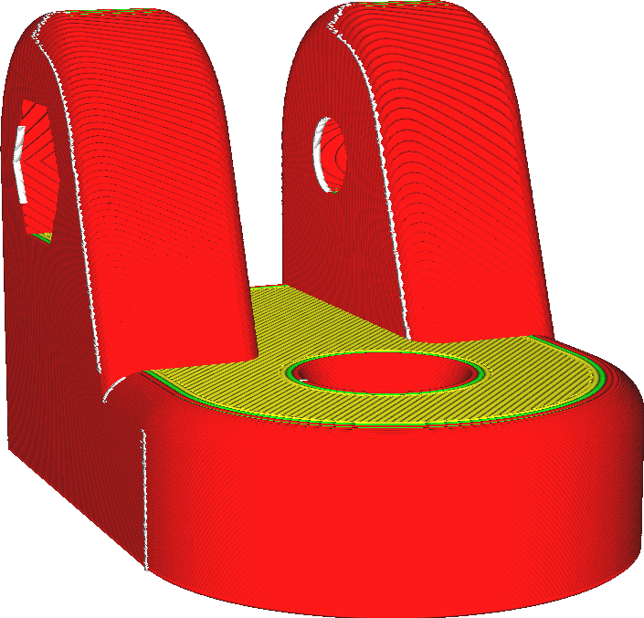
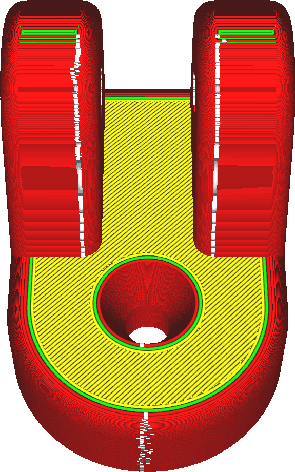

Z Seam Position
====
If the location of the seam is set to "User Specified" in the [Z Seam Alignment](z_seam_type.md) setting, the seam will be placed in the direction specified by this setting.

<!--screenshot {
"image_path": "z_seam_x_left.png",
"models": [
    {
        "script": "rod_holder.scad",
        "transformation": ["rotateZ(-90)"]
    }
],
"camera_position": [-55, 128, 40],
"settings": {
    "z_seam_type": "back",
    "z_seam_position": "left"
},
"colours": 64
}-->
<!--screenshot {
"image_path": "z_seam_y_back.png",
"models": [
    {
        "script": "rod_holder.scad",
        "transformation": ["rotateZ(-90)"]
    }
],
"camera_position": [0, -77, 130],
"settings": {
    "z_seam_type": "back",
    "z_seam_position": "back"
},
"colours": 64
}-->
<!--screenshot {
"image_path": "z_seam_x_right.png",
"models": [
    {
        "script": "rod_holder.scad",
        "transformation": ["rotateZ(-90)"]
    }
],
"camera_position": [55, 128, 40],
"settings": {
    "z_seam_type": "back",
    "z_seam_position": "right"
},
"colours": 64
}-->
<!--screenshot {
"image_path": "z_seam_y_front.png",
"models": [
    {
        "script": "rod_holder.scad",
        "transformation": ["rotateZ(-90)"]
    }
],
"camera_position": [0, 77, 130],
"settings": {
    "z_seam_type": "back",
    "z_seam_position": "front"
},
"colours": 64
}-->

Eight ordinal directions are available for the seam's position. It is best to choose a location for the seam that is hard to see in the final object, so it depends heavily on the design of your model. Usually it is best to choose a position of the seam that is in an inside corner, but if such a corner is not available you could also choose a position that is easy to cut away with a knife after printing.

**The seam is actually placed as close as possible to the position indicated by the [Z Seam X](z_seam_x.md) and [Z Seam Y](z_seam_y.md) settings. This is a convenience setting that sets those coordinates more intuitively.**