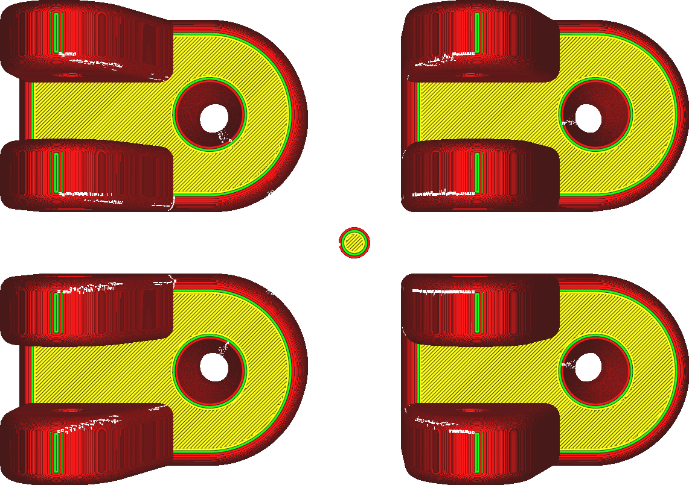
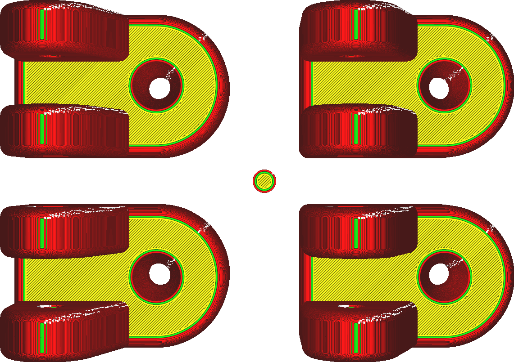

Z Seam Relative
====
When the seam is placed in a user-specified location according to the [Z Seam Alignment](z_seam_type.md) setting, you can enter coordinates for where the seam must be located. Normally those coordinates specify some location on the build plate, such as the back of the printer. If this setting is enabled, those coordinates will be taken relative to the position of the model.

<!--screenshot {
"image_path": "z_seam_relative_disabled.png",
"models": [
    {
        "script": "rod_holder.scad",
        "transformation": ["translateX(-30)", "translateY(-20)"]
    },
    {
        "script": "rod_holder.scad",
        "transformation": ["translateX(30)", "translateY(-20)"]
    },
    {
        "script": "rod_holder.scad",
        "transformation": ["translateX(30)", "translateY(20)"]
    },
    {
        "script": "rod_holder.scad",
        "transformation": ["translateX(-30)", "translateY(20)"]
    },
    {
        "script": "cylinder.scad",
        "transformation": ["scale(0.25)"]
    }
],
"camera_position": [0, 0, 250],
"settings": {
    "z_seam_type": "back",
    "z_seam_x": 500,
    "z_seam_y": 500,
    "z_seam_relative": false
},
"colours": 64
}-->
<!--screenshot {
"image_path": "z_seam_relative_enabled.png",
"models": [
    {
        "script": "rod_holder.scad",
        "transformation": ["translateX(-30)", "translateY(-20)"]
    },
    {
        "script": "rod_holder.scad",
        "transformation": ["translateX(30)", "translateY(-20)"]
    },
    {
        "script": "rod_holder.scad",
        "transformation": ["translateX(30)", "translateY(20)"]
    },
    {
        "script": "rod_holder.scad",
        "transformation": ["translateX(-30)", "translateY(20)"]
    },
    {
        "script": "cylinder.scad",
        "transformation": ["scale(0.25)"]
    }
],
"camera_position": [0, 0, 250],
"settings": {
    "z_seam_type": "back",
    "z_seam_x": 500,
    "z_seam_y": 500,
    "z_seam_relative": true
},
"colours": 64
}-->

When a mesh is duplicated on the build plate, this setting causes the seam to be positioned in exactly the same location for each of the duplicates, rather than having them point toward the same point on the build plate. This allows you to print every copy in exactly the same way regardless of their positions on the build plate.