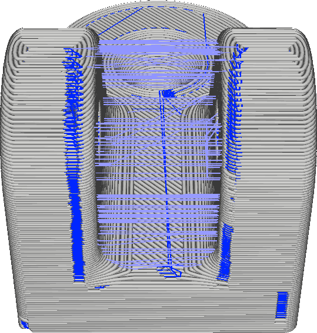

Z Seam Y
====
If the location of the seam is set to "User Specified" in the [Z Seam Alignment](z_seam_type.md) setting, the seam is placed close to the location specified with the [Z Seam X](z_seam_x.md) and Z Seam Y settings.

This setting indicates an absolute position on the build plate if [Z Seam Relative](z_seam_relative.md) is disabled, or a position relative to the centre of the model if Z Seam Relative is enabled. When the position is absolute, the coordinate is in the g-code coordinate system, which is different from the coordinates that Cura shows for the placement of objects.

It is useful to choose a location for the seam that is hardly visible in the application of your print. If no such location is available or some post-processing can be done after the print, you can opt to place the seam in a location where it can easily be cut off with a knife or sanded down.