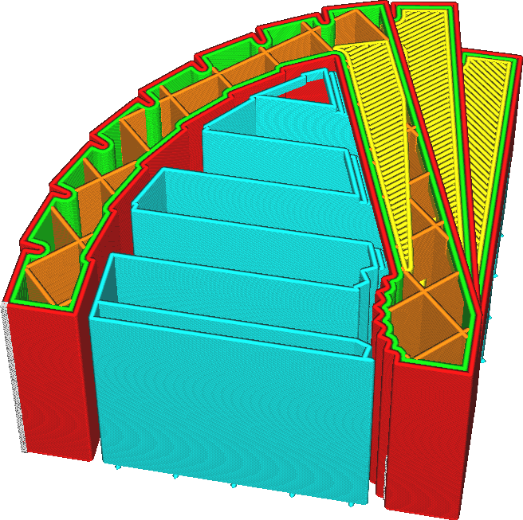

Support Density
====
This setting defines the rate at which the support structures are filled with material. At great infill rates, the support lines will be placed very close together. At low infill rates, the lines will be placed further apart.

Increasing the density of support has some positive and negative effects. Here are some of the effects that need to be weighed off:
* Since the distance between the support lines is smaller, the surface resting on top of this support will sag less.
* The support will be stronger, improving reliability of the print.
* It's harder to remove the support due to the increased adhesion surface.
* It will take more material to print the support.
* The print will take longer to complete.