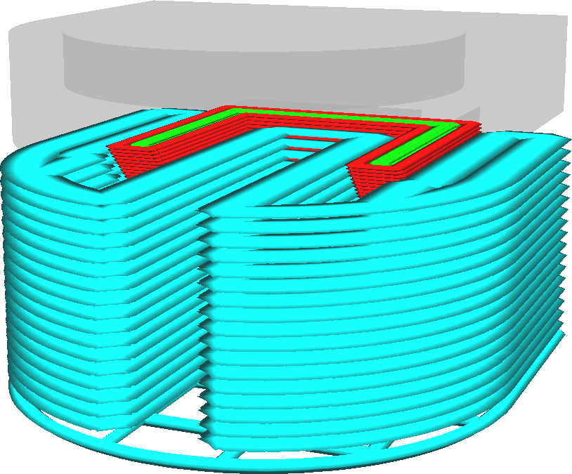

Support Infill Layer Thickness
====
Since the visual quality and resolution of support is not important, you can use thicker layers for the support to reduce printing time. This setting configures how thick the layers will be that the support is printed with.

In layer view, it will look as if the support lines have become much wider. When actually printed, the support lines will drop down further instead of spreading out horizontally.

<!--screenshot {
"image_path": "support_infill_sparse_thickness.png",
"models": [
    {
        "script": "calendar_holder.scad",
        "transformation": ["scale(0.5)", "rotateX(90)"]
    }
],
"camera_position": [18, 43, 19],
"settings": {
    "support_enable": true,
    "support_infill_sparse_thickness": 0.24
},
"layer": 148,
"colours": 64
}-->

The support infill layer thickness must be a multiple of the ordinary layer height. If it is not, it will be rounded to the closest layer height.

This setting does not apply to the support roof or floor, only to the main structure of the support.

This setting is particularly useful when printing the support with a different material as the rest of the print, and even more when that material is hard to extrude, such as PVA. Because the support is not extruded on every layer, the printer won't need to switch extruders as often, saving a lot of time. Because more material is extruded on layers that are printed, materials that take some time to get the flow starting will be printed more reliably.

Be careful with increasing this too much. When switching to and from support, the flow rate through the nozzle needs to accelerate and decelerate significantly. There is some delay on this, so it'll extrude too little at the beginning of the support and too much after the end of the support.