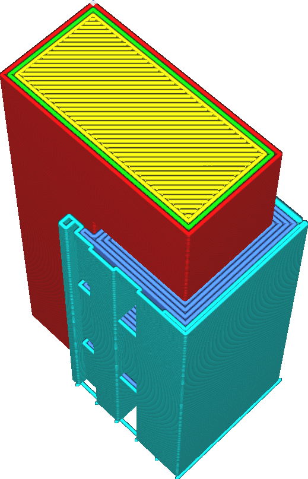

Support Interface Horizontal Expansion
====
This setting causes the support interface to be expanded in all directions horizontally into the rest of the support.

<!--screenshot {
"image_path": "support_interface_offset.png",
"models": [{"script": "f.scad"}],
"camera_position": [45, 45, 133],
"settings": {
    "support_enable": true,
    "support_interface_enable": true,
    "support_offset": 2,
    "support_interface_offset": 1
},
"colours": 64
}-->

There are two use cases for this mechanism.
* If the support interface ends directly at the edge of the overhang that needs to be supported, the build material can sag over the edge. Making the interface expand a bit further will prevent this.
* Some materials typically used to print support with extrude badly at low flow rates or need some time to get going. Small areas of support interface don't jive well with those materials. This setting can literally make the areas larger so that there is more space to extrude these materials.

Due to technical limitations, the support interface cannot be expanded beyond the support itself.