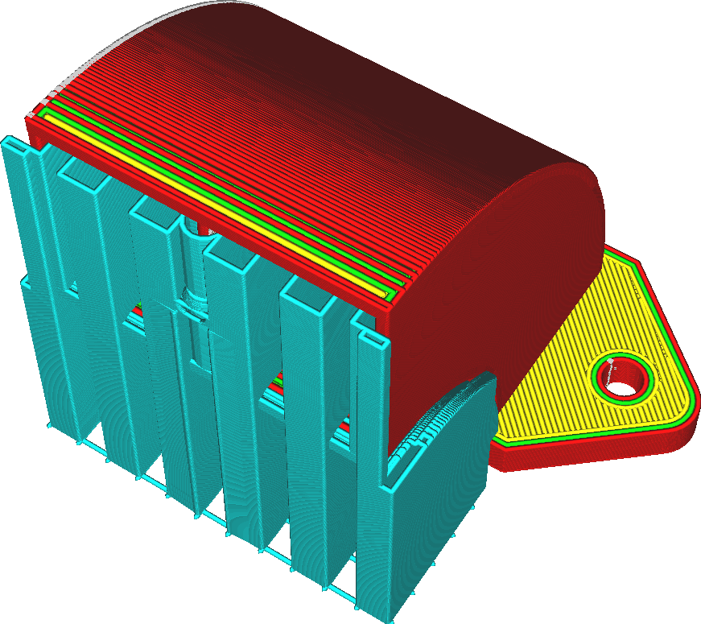

Support Horizontal Expansion
====
This setting causes the support to become slightly wider, expanding horizontally in every direction.

<!--screenshot {
"image_path": "support_offset.png",
"models": [{"script": "duct.scad"}],
"camera_position": [47, 72, 128],
"settings": {
    "support_enable": true,
    "support_offset": 1.6
},
"colours": 64
}-->

This setting has multiple uses, depending on the material used for support and the type of model that needs supporting:
* Increasing this setting will make support wider and thus sturdier. This is useful for tall models with small areas of overhang, since the overhang would otherwise be supported with a very tall, thin pillar of support. With some horizontal expansion, it becomes a very tall but slightly wider pillar of support.
* Increasing this setting also functions as a safety measure to make sure that support areas have a certain minimum area. This is necessary for materials that are hard to extrude, such as PVA.
* Reducing this setting will reduce material usage and printing time for support. Increasing it will increase the required material and printing time, of course. See also the [conical support](../experimental/support_conical_enabled.md) feature, which reduces the width of support without compromising the area that the support supports.
* Setting this setting to a negative value can also remove thin pillars of support completely. If that support would fail to print anyway, it may be better to just leave it out altogether. A method to remove support without compromising the overhang quality of the rest of the model is the Support Blocker tool.