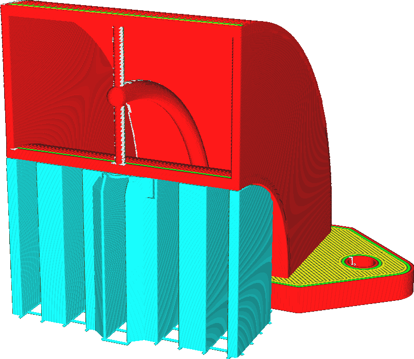

This setting allows you to choose what support can be placed on top of.

Placing support everywhere is more reliable for the support. All overhangs that would sag are supported properly. However, the support may rest on top of the model as well, leaving a scar where it touches. This reduces the visual quality and the smoothness of the model's surface after the support is removed.

Instead, placing support only if it touches the build plate prevents support from resting on the model. This may leave some parts of your model unsupported, though.

*As a trick when using support on the build plate only, try [enabling conical support](../experimental/support_conical_enabled.md) and giving the [Conical Support Angle](../experimental/support_conical_angle.md) a negative value. This allows the support to grow around the model and still support most of the mesh without resting on the model. Alternatively, try tree support.*