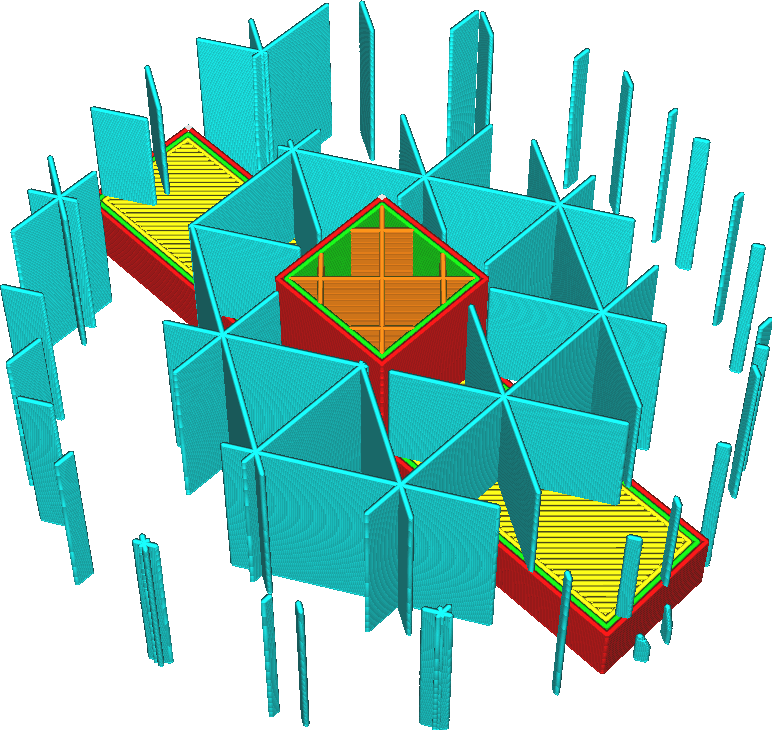
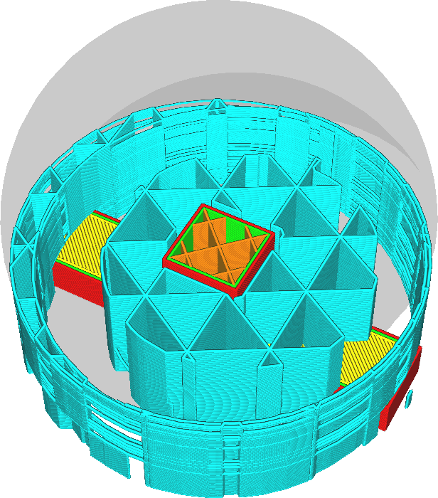

Connect Support Lines
====
With some support patterns, the support can become very unstable when thin strips of support are needed. This setting will cause the endpoints of the support lines to be connected together. This gives them more stability. It also makes the support print with more continuous flow. Fewer travel moves will be necessary.

<!--screenshot {
"image_path": "zig_zaggify_support_disabled.png",
"models": [{"script": "plug.scad"}],
"camera_position": [71, 71, 147],
"settings": {
    "support_enable": true,
    "support_pattern": "triangles",
    "support_wall_count": 0,
    "support_offset": 0.2,
    "zig_zaggify_support": false
},
"layer": 236,
"colours": 64
}-->
<!--screenshot {
"image_path": "zig_zaggify_support_enabled.png",
"models": [{"script": "plug.scad"}],
"camera_position": [71, 71, 147],
"settings": {
    "support_enable": true,
    "support_pattern": "triangles",
    "support_wall_count": 0,
    "support_offset": 0.2,
    "zig_zaggify_support": true
},
"layer": 236,
"colours": 64
}-->

When a support line is drawn, instead of travelling to the next line, a line will be drawn along the border of the support area towards the next line. This converts the entire support pattern into a single or very few lines. Converting it into a single line is not always possible. The starting point of this line is arbitrary, so very often there will be lines hanging in mid-air because in one layer two lines may be connected on one end-point, while on the next layer they are connected on the other side. This makes support somewhat weaker but still stable and it still prevents interruptions in flow. The behaviour of this setting is the same as for [Connect Infill Lines](../infill/zig_zaggify_infill.md).

Connecting the support lines has a couple of benefits, but also some downsides:
* The support will be more stable, less likely to topple over during printing.
* The flow rate will be held more constant, allowing you to print the support at greater speed without flow problems. This is especially important for support materials that are hard to extrude properly.
* If retractions are made during support, significantly fewer retractions will be necessary during the printing of support, which prevents the material from grinding.
* It takes more material to print the support.
* Usually it will take more time to print the support, since travel moves are normally faster than printing support lines.

The zigzag support pattern is always connected (using a slightly different technique). This setting is not available for the zigzag pattern.