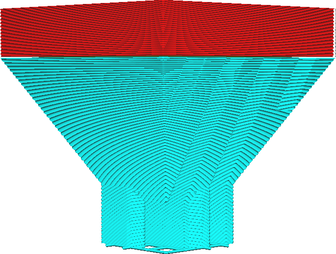

If this setting is enabled, the support structure will no longer be completely vertical on the sides. The support will get a conical shape, getting either smaller or larger towards the bottom.

The support itself will slope with a certain [angle](support_conical_angle.md). With negative angles, the support will get larger towards the bottom, making the support significantly more stable. With positive angles, it will get smaller towards the bottom. This saves a lot of material and printing time. To prevent the support from getting unstable, a [minimum width](support_conical_min_width.md) can be defined for the support as well.

Conical support is the most powerful parameter for the weigh-off between printing time and the stability of support. There are two main use cases for conical support:
* To save material and printing time. Conical support can easily save you half of the material required for support, and by extension half of the time spent on printing it. This is especially effective if there are large volumes of support, for large and tall prints.
* To make the support more stable using a negative angle. If your print has tiny features high up that need supporting, they will normally produce very tall [towers](support_use_towers.md) that are prone to falling over during the print. With conical support, these tall, thin support structures can be made wider at the bottom. This gives them some added stability. However, it will take longer to print this support since it requires more material.