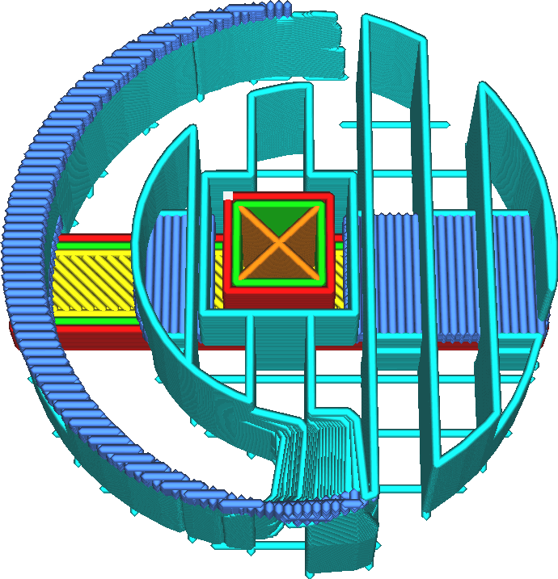
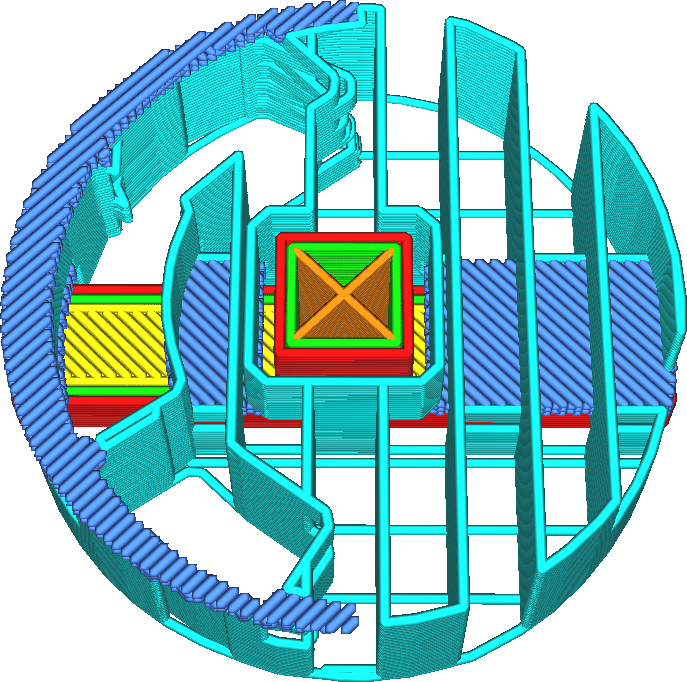

The support interface is normally oriented to be as perpendicular as possible to the model and the support body that surrounds it. If the orientation of the top/bottom lines or the support lines has been customised, it is a good idea to customise the orientation of the support interface lines as well. This setting allows you to customise the orientation of the support interface lines.

Multiple angles can be filled in for this setting, separated by commas. Cura will alternate these angles across the layers.

The support interface lines will ideally be oriented to be perpendicular to the lines that they rest on as well as to the lines that rest on them. Orienting them perpendicularly reduces the distance that these lines have to bridge and thus reduces sagging and improves the quality of overhangs. This is especially important when working with support that isn't completely dense.